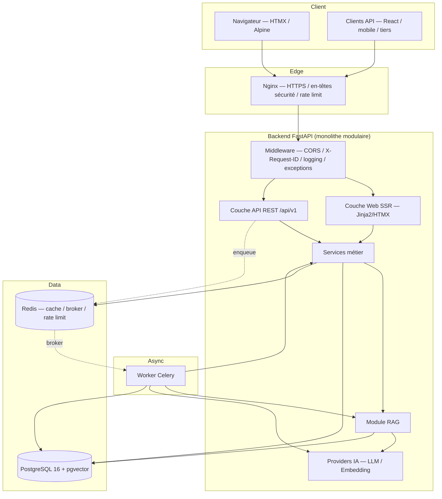
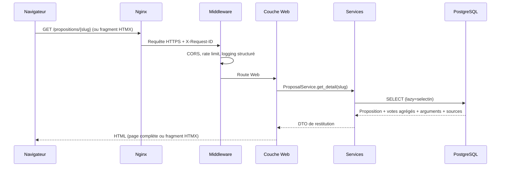
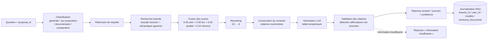
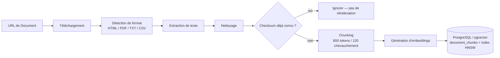
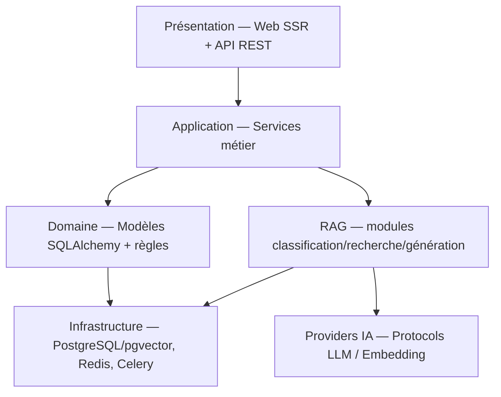
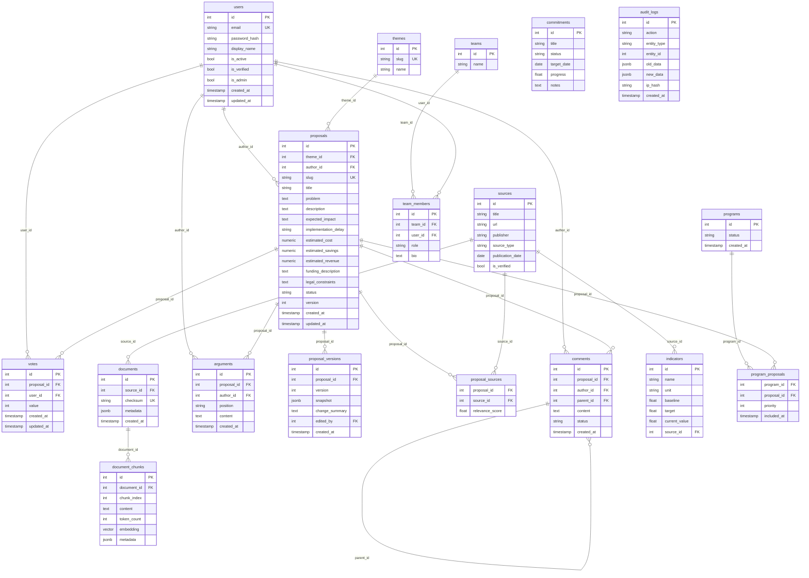

# Document de Conception — PARTIPOLAI (V1)

## Overview

PARTIPOLAI est une plateforme de parti politique virtuel dont l'entité centrale est la
**Proposition** de politique publique. La conception V1 couvre l'intégralité du périmètre du cahier
des charges technique : comptes et authentification, référentiel de 25 Thèmes, cycle de vie des
Propositions et historique complet de leurs versions, vote à trois valeurs, débat argumenté
(Arguments et Commentaires), Sources documentaires, pipeline d'ingestion documentaire, recherche
hybride, Assistant IA/RAG avec garde-fous anti-hallucination, construction de Programme, équipes,
suivi de mandat, modération simple, statistiques anonymisées, API REST versionnée, sécurité,
conformité RGPD, observabilité et infrastructure conteneurisée.

**Principe directeur (Exigence 15, 19, 33) :** la Plateforme **restitue des résultats de
participation** ; l'IA **documente et assiste**, mais **ne vote pas** et **ne décide pas du
Programme**. L'inclusion définitive d'une Proposition dans un Programme reste un acte **explicite et
traçable** (Exigence 18/19), jamais produit automatiquement par l'IA. Toute la conception préserve
cette séparation : les composants IA/RAG n'écrivent jamais dans les tables de décision (votes,
program_proposals) ; ils produisent uniquement des réponses documentées et citées.

### Choix structurants

- **Architecture** : monolithe modulaire (Exigence 33) — un backend FastAPI unique exposant l'API
  REST et le rendu Web SSR, une couche de Services métier, PostgreSQL 16 + pgvector, Redis, un
  Worker Celery, le RAG intégré au backend et au worker. Aucun micro-service en V1. Trajectoire
  d'évolution préservée : V1 monolithe modulaire → V2 frontend séparé → V3 services IA/RAG
  spécialisés → V4 distribution.
- **Stack** : Python 3.13+, FastAPI, Pydantic v2, SQLAlchemy 2.x (style `Mapped` typé,
  `relationship(lazy="selectin")` pour éviter le N+1), Alembic, psycopg 3, PostgreSQL 16+, pgvector,
  Redis, Celery.
- **Frontend V1** : rendu côté serveur avec Jinja2, HTMX, Alpine.js et Tailwind (Exigence 25), plus
  une API REST complète prête pour des clients ultérieurs (React, mobile, natif, tiers).
- **Langue** : interface et API en français pour la V1.

### Fournisseurs de sources documentaires

Les documents ingérés (Exigence 11) alimentent la base pgvector qui fonde toutes les réponses de
l'Assistant IA. La qualité de source (`source_type`, `is_verified`) intervient à la fois dans le
score de fusion de la recherche hybride (Exigence 12) et dans la vue « Programme en construction »
(Exigence 19).

---

## Architecture

### Diagramme de composants (monolithe modulaire)



Le RAG est **intégré** au backend et au worker (Exigence 33.1) : une même base de code de modules
`rag/` est appelée en ligne pour `POST /api/v1/chat` et hors-ligne (worker) pour l'ingestion et la
génération d'embeddings.

### Flux de requête Web (HTMX)



Les interactions dynamiques (vote, ajout de commentaire, requête IA) sont des requêtes HTMX qui
appellent l'API et remplacent un fragment de page, sans SPA (Exigence 25.1).

### Flux du Pipeline RAG (POST /api/v1/chat)



La récupération documentaire (retrieval) est **obligatoire avant toute génération** (Exigence 14.1) :
si aucun passage pertinent n'est retenu, le pipeline renvoie « information insuffisante » plutôt que
d'inventer (Exigences 13.8, 14.6).

### Flux du Pipeline d'ingestion documentaire



Chaque étape est une tâche Celery dédiée (Exigence 23) : `ingest_document` orchestre
`extract_document` → `chunk_document` → `generate_embeddings`, avec `reindex_document` pour la
reconstruction. L'API n'est jamais bloquée (Exigence 23.3).

### Modèle en couches



La couche domaine ne dépend pas des Providers IA ; les Providers sont injectés au module RAG, qui
est isolé du domaine (Exigence 16.4).

---

## Components and Interfaces

Les signatures ci-dessous sont logiques (Python 3.13, typage `Mapped`/Pydantic v2). Elles décrivent
le contrat des composants, non l'implémentation finale.

### Services métier (`app/services/`)

#### AuthService
```python
class AuthService:
    def register(self, email: str, password: str, display_name: str) -> User: ...
    def authenticate(self, email: str, password: str) -> TokenPair: ...
    def refresh(self, refresh_token: str) -> AccessToken: ...
    def logout(self, session_id: str) -> None: ...
    def current_user(self, access_token: str) -> UserPublic: ...
    def hash_password(self, plain: str) -> str: ...        # argon2 (fallback bcrypt)
    def verify_password(self, plain: str, hashed: str) -> bool: ...
```
Le mot de passe est haché avec argon2 (ou bcrypt) et stocké uniquement dans `password_hash`
(Exigence 1.3). Les erreurs d'inscription/connexion renvoient un message **générique** (Exigences
1.2, 1.9).

#### ThemeService
```python
class ThemeService:
    def list_themes(self) -> list[Theme]: ...
    def get_theme(self, theme_id: int) -> Theme: ...
    def list_proposals_for_theme(self, theme_id: int, *, page: int, limit: int) -> Page[Proposal]: ...
```
Référentiel figé à **25 Thèmes** (Exigence 2), amorcé par `scripts/seed.py`.

#### ProposalService
```python
class ProposalService:
    def create(self, author: User, data: ProposalCreate) -> ProposalWithDuplicates: ...
    def get(self, proposal_id: int) -> ProposalDetail: ...
    def list(self, *, theme: str | None, status: str | None, sort: str,
             search: str | None, page: int, limit: int) -> Page[ProposalSummary]: ...
    def update(self, actor: User, proposal_id: int, data: ProposalUpdate) -> Proposal: ...   # nouvelle version
    def archive(self, actor: User, proposal_id: int) -> Proposal: ...                        # status ARCHIVED
    def _snapshot_version(self, proposal: Proposal, change_summary: str) -> ProposalVersion: ...
    def _make_slug(self, title: str) -> str: ...
```
Création à l'état DRAFT, version 1, slug attribué (Exigence 3.2). Toute modification crée une
`ProposalVersion` complète avec `change_summary` et incrémente `version`, sans jamais écraser une
version antérieure (Exigences 3.4, 3.5). Le tri (`sort`) n'utilise jamais `ORDER BY vote_count`
(Exigence 7.3).

#### DuplicateDetectionService
```python
class DuplicateDetectionService:
    def find_similar(self, title: str, description: str, *, threshold: float,
                     top_k: int) -> list[SimilarProposal]: ...
```
Calcule un embedding de la Proposition et recherche les Propositions proches par similarité cosinus
(Exigence 5.1). L'API renvoie les similaires et les actions Consulter / Créer quand même / Améliorer
(Exigence 5.2) ; « Créer quand même » ne bloque pas (Exigence 5.3).

#### VoteService
```python
class VoteService:
    def cast(self, user: User, proposal_id: int, value: int) -> VoteCounts: ...   # UPSERT +1/0/-1
    def withdraw(self, user: User, proposal_id: int) -> VoteCounts: ...           # DELETE
    def counts(self, proposal_id: int) -> VoteCounts: ...
```
UPSERT sur la contrainte `UNIQUE(proposal_id, user_id)` (Exigences 6.2, 6.3). `value ∈ {+1, 0, -1}`.

#### PopularityService
```python
class PopularityService:
    def compute(self, proposal_id: int) -> Popularity: ...
    # support_count, oppose_count, participation_count,
    # support_rate = support/(support+oppose), 0 si dénominateur nul
```
Renvoie toujours les décomptes absolus aux côtés du taux (Exigences 7.1, 7.2, 7.4).

#### ArgumentService / CommentService
```python
class ArgumentService:
    def create(self, user: User, proposal_id: int, position: str, content: str) -> Argument: ...  # FOR/AGAINST
    def update(self, actor: User, argument_id: int, content: str) -> Argument: ...
    def delete(self, actor: User, argument_id: int) -> None: ...

class CommentService:
    def create(self, user: User, proposal_id: int, content: str,
               parent_id: int | None) -> CommentSubmission: ...   # -> Moteur_De_Modération
    def list_thread(self, proposal_id: int) -> list[CommentNode]: ...
    def update(self, actor: User, comment_id: int, content: str) -> Comment: ...
    def delete(self, actor: User, comment_id: int) -> None: ...
```
Auteur/Administrateur seuls habilités à modifier/supprimer (Exigences 8.3, 4.7). Un commentaire
publié est `VISIBLE` (Exigence 9.4) ; il passe systématiquement par le Moteur de Modération
(Exigence 9.1).

#### SourceService
```python
class SourceService:
    def create(self, admin: User, data: SourceCreate) -> Source: ...
    def attach_to_proposal(self, admin: User, proposal_id: int, source_id: int,
                           relevance_score: float) -> ProposalSource: ...
    def list_sources(self, *, source_type: str | None) -> list[Source]: ...
```
`source_type ∈ {OFFICIAL, ACADEMIC, STATISTICAL, MEDIA, REPORT, LEGISLATION, OTHER}` (Exigence
10.2). Gestion réservée à l'Administrateur (Exigence 10.4).

#### ModerationService (Moteur_De_Modération)
```python
class ModerationService:
    def moderate(self, comment: Comment) -> ModerationDecision: ...
    # filtre automatique -> classification -> conforme|douteux
```
« conforme » ⇒ publication `VISIBLE` ; « douteux » ⇒ File_De_Modération sans publication ; chaque
décision est consignée dans `audit_logs` (Exigence 17). Pas de tri IA à trois niveaux, pas de
scoring comportemental.

#### ProgramService
```python
class ProgramService:
    def get_program(self) -> Program: ...
    def list_program_proposals(self) -> list[ProgramProposal]: ...
    def add_proposal(self, admin: User, proposal_id: int, priority: int) -> ProgramProposal: ...
    def remove_proposal(self, admin: User, proposal_id: int) -> None: ...
    def statistics(self) -> ProgramStatistics: ...
    def build_draft_view(self) -> DraftProgramView: ...   # « Programme en construction » (calcul, non décisionnel)
```
`priority` et `included_at` sont des attributs de `program_proposals` (Exigence 18.4). La vue
« Programme en construction » est un **calcul de restitution** (fortement soutenues + suffisamment
documentées + non contradictoires + estimées financièrement) qui ne décide pas de l'inclusion :
l'inclusion définitive reste explicite via `add_proposal` (Exigence 19).

#### TeamService / MandateService
```python
class TeamService:
    def create_team(self, admin: User, name: str) -> Team: ...
    def add_member(self, admin: User, team_id: int, role: str, bio: str) -> TeamMember: ...

class MandateService:
    def upsert_commitment(self, admin: User, data: CommitmentInput) -> Commitment: ...  # status NOT_STARTED..ABANDONED
    def update_indicator(self, admin: User, indicator_id: int, current_value: float) -> Indicator: ...
```

#### StatisticsService
```python
class StatisticsService:
    def global_counts(self) -> GlobalStatistics: ...
    # users, proposals, votes, comments, sources, themes — agrégés/anonymisés
```
Aucune statistique individuelle reconstituant les opinions (Exigence 22.3).

#### AuditService
```python
class AuditService:
    def record(self, *, action: str, entity_type: str, entity_id: int,
               old_data: dict | None, new_data: dict | None, ip_hash: str) -> AuditLog: ...
```
`ip_hash` uniquement, jamais l'IP brute (Exigence 29.2).

### Modules RAG (`app/rag/`)

```python
class QuestionClassifier:
    def classify(self, message: str, proposal_id: int | None) -> QuestionType: ...
    # QuestionType ∈ {GENERAL, ON_PROPOSITION, DOCUMENTARY, COMPARATIVE}

class QueryRewriter:
    def rewrite(self, message: str, question_type: QuestionType,
                proposal: Proposal | None) -> str: ...

class HybridSearch:
    def search(self, query: str, *, top_k: int) -> list[Candidate]: ...   # tsvector + pgvector cosinus

class ScoreFusion:
    WEIGHTS = {"semantic": 0.40, "lexical": 0.30, "source_quality": 0.20, "recency": 0.10}  # configurables
    def fuse(self, candidates: list[Candidate]) -> list[ScoredChunk]: ...

class Reranker:
    def rerank(self, scored: list[ScoredChunk], *, keep: int = 6) -> list[ScoredChunk]: ...  # 20 -> 6

class ContextBuilder:
    def build(self, chunks: list[ScoredChunk]) -> tuple[str, list[Citation]]: ...  # citations numérotées

class CitationValidator:
    def validate(self, answer: str, citations: list[Citation]) -> ValidationResult: ...
    # détecte les affirmations factuelles non sourcées

class RagPipeline:
    def answer(self, message: str, proposal_id: int | None, user: User | None) -> ChatResponse: ...
    # ChatResponse = {answer, sources[], confidence}
```

Le `RagPipeline` enchaîne classification → réécriture → recherche hybride → fusion → reranking →
contexte → génération LLM (faible température) → validation des citations → réponse (Exigence 13.3),
puis journalise (request_id, user_id, modèle, retrieved_documents) via l'observabilité (Exigences
14.7, 30.2). Le **prompt système** impose : répondre uniquement à partir du contexte fourni ;
distinguer faits / estimations / opinions / hypothèses / désaccords entre Sources ; ne jamais
inventer de nombres ; indiquer explicitement l'indisponibilité ; associer chaque affirmation
factuelle importante à une Source ; ne pas transformer une information descriptive en recommandation
politique ; sur question sensible, privilégier « Voici les arguments documentés » et ne jamais
formuler de recommandation de vote individuelle (Exigences 13.5–13.10, 15).

### Modules d'ingestion (`app/rag/` + `app/workers/`)

```python
class Downloader:
    def fetch(self, url: str) -> RawDocument: ...

class FormatDetector:
    def detect(self, raw: RawDocument) -> DocFormat: ...   # HTML | PDF | TXT | CSV

class TextExtractor:
    def extract(self, raw: RawDocument, fmt: DocFormat) -> str: ...

class TextCleaner:
    def clean(self, text: str) -> str: ...

class Deduplicator:
    def checksum(self, content: str) -> str: ...
    def is_known(self, checksum: str) -> bool: ...   # documents.checksum UNIQUE

class Chunker:
    def chunk(self, text: str, *, size_tokens: int = 800, overlap_tokens: int = 120) -> list[Chunk]: ...
    # metadata: source_id, document_id, page, section, publication_date
```

### Providers IA (`app/rag/providers/`)

```python
class LLMProvider(Protocol):
    def generate(self, messages: list[Message], temperature: float) -> str: ...

class EmbeddingProvider(Protocol):
    def embed(self, texts: list[str]) -> list[list[float]]: ...
```

Implémentations sous `providers/openai/`, `providers/anthropic/`, `providers/local/`. Le fournisseur
et le modèle sont configurables par variables d'environnement (`LLM_PROVIDER`, `LLM_MODEL`,
`EMBEDDING_PROVIDER`, `EMBEDDING_MODEL`) (Exigence 16). Les Providers sont injectés au RAG et isolés
du domaine.

### Tâches Celery (`app/workers/`)
```
ingest_document · extract_document · chunk_document · generate_embeddings
reindex_document · moderate_comment · recalculate_statistics
```
Broker/back-end Redis ; l'API émet les tâches sans bloquer (Exigence 23).

### Middleware et infrastructure (`app/core/`)
- `RequestIdMiddleware` (X-Request-ID), `SecurityHeadersMiddleware` (X-Content-Type-Options,
  X-Frame-Options, Referrer-Policy, Content-Security-Policy), CORS, journalisation structurée,
  gestionnaire global d'exceptions (Exigence 26).
- `RateLimiter` basé sur Redis, appliqué à login/register/chat/proposals/comments/votes, avec
  protection renforcée de `POST /api/v1/chat` (Exigences 26.4, 26.5).
- Sécurité JWT (access + refresh), cookies HttpOnly/Secure/SameSite=Lax pour le web (Exigence 1.5,
  26.8).

---

## Data Models

### Diagramme entité-relation



### Contraintes et index clés

- `users.email` **UNIQUE** (Exigence 1.1) ; `password_hash` seul stockage du mot de passe (1.3).
- `themes` amorcé à **25 lignes** (Exigence 2.1) ; `proposals.theme_id` NOT NULL (2.5).
- `proposals.slug` **UNIQUE**, `status` contraint à `{DRAFT, PENDING_REVIEW, PUBLISHED, ARCHIVED,
  REJECTED}` (Exigence 3.3), `version` ≥ 1.
- `proposal_versions` : historique complet, jamais écrasé ; `snapshot` jsonb + `change_summary`
  (Exigences 3.4, 3.5).
- `votes` : **UNIQUE(proposal_id, user_id)** (Exigence 6.2), `value ∈ {-1, 0, +1}` (contrainte
  CHECK) ; UPSERT à la revote, DELETE au retrait (6.3, 6.4).
- `comments.parent_id` auto-référence pour les fils (Exigence 9.2) ; `status = VISIBLE` par défaut à
  la publication (9.4).
- `sources.source_type` contraint aux 7 valeurs (Exigence 10.2) ; `proposal_sources` porte
  `relevance_score` (10.3).
- `documents.checksum` **UNIQUE** — pas de réindexation d'un checksum connu (Exigence 11.3).
- `document_chunks.embedding` de type **`VECTOR(dim)`**, `dim` configurable (défaut **1536**) ;
  index **HNSW** avec `vector_cosine_ops` :
  ```sql
  CREATE INDEX ON document_chunks USING hnsw (embedding vector_cosine_ops);
  ```
  Colonne `tsvector` générée sur `content` + index GIN pour la recherche lexicale (Exigences 11.6,
  12.1). `metadata` conserve source_id, document_id, page, section, publication_date (11.5).
- `program_proposals` : **priority + included_at** attributs de l'association (Exigence 18.2, 18.4).
- `audit_logs` : `ip_hash` uniquement, jamais l'IP brute (Exigence 29).
- Toutes les `relationship` sont configurées en `lazy="selectin"` pour éviter le N+1.
- Aucune colonne de profession, orientation politique, localisation précise ou PII superflue
  (Exigence 28.1, 28.2).

---

## REST API Design

Toutes les routes sous le préfixe `/api/v1`. Codes : 200 OK, 201 Created, 204 No Content, 400
validation, 401 non authentifié, 403 interdit, 404 introuvable, 409 conflit, 429 rate limit.

| Méthode | Chemin | Auth | Description | Codes |
|---|---|---|---|---|
| POST | `/auth/register` | Non | Inscription (erreur générique si email connu) | 201, 400 |
| POST | `/auth/login` | Non | Émet access + refresh (cookies HttpOnly côté web) | 200, 401, 429 |
| POST | `/auth/refresh` | Refresh | Nouveau access token | 200, 401 |
| POST | `/auth/logout` | Oui | Invalide la session | 204, 401 |
| GET | `/auth/me` | Oui | Compte courant sans password_hash | 200, 401 |
| GET | `/themes` | Non | Liste des 25 Thèmes | 200 |
| GET | `/themes/{id}` | Non | Détail d'un Thème | 200, 404 |
| GET | `/themes/{id}/proposals` | Non | Propositions d'un Thème | 200, 404 |
| POST | `/proposals` | Oui | Crée (DRAFT) + détection de doublons | 201, 400, 401, 429 |
| GET | `/proposals` | Non | Liste (theme, status, sort, search, page, limit) | 200 |
| GET | `/proposals/{id}` | Non | Détail | 200, 404 |
| PUT | `/proposals/{id}` | Auteur/Admin | Nouvelle version | 200, 400, 401, 403, 404 |
| DELETE | `/proposals/{id}` | Auteur/Admin | Passe en ARCHIVED | 204, 401, 403, 404 |
| POST | `/proposals/{id}/votes` | Oui | Vote UPSERT {value ∈ +1/0/-1} | 200, 400, 401, 429 |
| DELETE | `/proposals/{id}/votes` | Oui | Retire le vote | 204, 401 |
| GET | `/proposals/{id}/votes` | Non | Décomptes de votes | 200, 404 |
| POST | `/proposals/{id}/arguments` | Oui | Argument FOR/AGAINST | 201, 400, 401 |
| PUT | `/arguments/{id}` | Auteur/Admin | Modifie | 200, 401, 403, 404 |
| DELETE | `/arguments/{id}` | Auteur/Admin | Supprime | 204, 401, 403, 404 |
| GET | `/proposals/{id}/comments` | Non | Fils de discussion | 200, 404 |
| POST | `/proposals/{id}/comments` | Oui | Commentaire → modération | 201, 400, 401, 429 |
| PUT | `/comments/{id}` | Auteur/Admin | Modifie | 200, 401, 403, 404 |
| DELETE | `/comments/{id}` | Auteur/Admin | Supprime | 204, 401, 403, 404 |
| GET | `/sources` | Non | Liste des Sources | 200 |
| POST | `/sources` | Admin | Crée une Source | 201, 400, 401, 403 |
| POST | `/proposals/{id}/sources` | Admin | Rattache une Source (relevance_score) | 201, 401, 403, 404 |
| POST | `/admin/documents/ingest` | Admin | Déclenche l'ingestion (Celery) | 202, 401, 403 |
| POST | `/chat` | Oui (protégé) | RAG {message, proposal_id} → {answer, sources[], confidence} | 200, 400, 401, 429 |
| GET | `/program` | Non | Programme | 200 |
| GET | `/program/proposals` | Non | Propositions du Programme | 200 |
| POST | `/program/proposals` | Admin | Ajoute (priority, included_at) | 201, 401, 403 |
| DELETE | `/program/proposals/{id}` | Admin | Retire l'association | 204, 401, 403, 404 |
| GET | `/program/statistics` | Non | Statistiques du Programme | 200 |
| GET | `/statistics` | Non | Compteurs agrégés anonymisés | 200 |
| GET | `/teams` | Non | Équipes et membres | 200 |
| GET | `/mandate/commitments` | Non | Engagements | 200 |
| GET | `/mandate/indicators` | Non | Indicateurs | 200 |

Points de contrôle hors `/api/v1` : `GET /health` → `{status: ok}` (Exigence 27.1) ; `GET /ready`
vérifie PostgreSQL + Redis (27.2). Pages Web SSR publiques (Exigence 24) : fiche Proposition
`/propositions/{slug}`, page Programme `/programme`, et pages RGPD `/mentions-legales`,
`/confidentialite`, `/cookies`, `/conditions` (Exigence 28.3).

---

## Correctness Properties

_Une propriété est une caractéristique ou un comportement qui doit rester vrai pour toutes les
exécutions valides du système — une formulation formelle de ce que le système doit faire. Les
propriétés servent de pont entre les spécifications lisibles par un humain et des garanties de
correction vérifiables par machine. Chaque propriété ci-dessous est universellement quantifiée
(« pour tout / pour toute ») et destinée à des tests basés sur les propriétés (property-based
testing) exécutant au minimum 100 itérations par propriété._

Le périmètre PBT couvre la logique métier pure et les fonctions à contrat clair (vote, taux de
soutien, versionnement, chunking, déduplication, fusion/reranking, ancrage RAG avec Providers
simulés). Les points d'accès HTTP, la configuration d'infrastructure et les vérifications de santé
sont couverts par des tests d'exemple/intégration décrits dans la stratégie de test.

### Property 1: Unicité et idempotence du Vote

_Pour tout_ couple (Utilisateur, Proposition) et _pour toute_ séquence d'opérations de vote dont
les valeurs appartiennent à {+1, 0, -1}, il existe au plus une ligne de Vote pour ce couple après
application de la séquence, et sa valeur est égale à la dernière valeur soumise ; un revote remplace
la valeur sans créer de ligne supplémentaire.

**Validates: Requirements 6.2, 6.3**

### Property 2: Round-trip de retrait de Vote

_Pour tout_ couple (Utilisateur, Proposition) et _pour toute_ valeur v ∈ {+1, 0, -1}, l'application
de `cast(v)` puis de `withdraw` laisse aucun Vote pour ce couple, et les décomptes
(support_count, oppose_count, participation_count) sont identiques à l'état antérieur au `cast`.

**Validates: Requirements 6.4**

### Property 3: Taux de soutien borné et exclusion du NEUTRE

_Pour tout_ multiensemble de valeurs de Votes ∈ {+1, 0, -1} associées à une Proposition, le
Taux_De_Soutien vaut support_count / (support_count + oppose_count), appartient toujours à
l'intervalle [0, 1], vaut exactement 0 lorsque le dénominateur est nul, et reste inchangé par
l'ajout ou le retrait de Votes NEUTRE (0), qui sont exclus du dénominateur.

**Validates: Requirements 7.2**

### Property 4: Versionnement monotone et historique immuable

_Pour toute_ Proposition et _pour toute_ séquence de N modifications valides, l'attribut `version`
croît strictement de manière monotone et vaut `version_initiale + N` ; chaque modification produit
une nouvelle `Version_De_Proposition` (jamais un écrasement d'une version antérieure) ; l'ensemble
des snapshots antérieurs demeure inchangé, y compris pour une Proposition publiée.

**Validates: Requirements 3.4, 3.5**

### Property 5: Idempotence de l'ingestion par checksum

_Pour tout_ Document, ingérer deux fois le même contenu (même checksum) ne produit qu'un seul jeu de
Chunks_De_Document et d'embeddings : à la seconde passe, le checksum est reconnu comme déjà connu et
aucune écriture supplémentaire n'est effectuée (pas de réindexation).

**Validates: Requirements 11.3**

### Property 6: Invariants de chunking et préservation des métadonnées

_Pour tout_ texte extrait, le découpage produit des Chunks_De_Document dont la taille est d'environ
800 tokens (tous les chunks sauf éventuellement le dernier) avec un chevauchement de 120 tokens
entre chunks consécutifs, et chaque chunk porte l'intégralité des métadonnées requises (source_id,
document_id, page, section, publication_date).

**Validates: Requirements 11.4, 11.5**

### Property 7: Ancrage documentaire des réponses RAG

_Pour tout_ contexte documentaire récupéré non vide, toute affirmation factuelle importante de la
réponse générée renvoie à au moins une Source citée ; _pour tout_ cas où la récupération ne retient
aucun passage pertinent, la réponse est « information insuffisante » et n'introduit aucun nombre qui
n'est pas présent dans le contexte fourni (aucune invention de nombres).

**Validates: Requirements 13.5, 13.7, 13.8, 13.9, 14.1, 14.6**

### Property 8: Somme des poids de fusion égale à 1.0

_Pour tout_ ensemble de candidats issus de la Recherche_Hybride, le score fusionné est la
combinaison `0,40 × sémantique + 0,30 × lexical + 0,20 × qualité_de_source + 0,10 × récence`, dont
les poids somment exactement à 1.0 ; le score fusionné est donc une combinaison convexe des
sous-scores.

**Validates: Requirements 12.2**

### Property 9: Reranking — exactement 6 parmi les 20 meilleurs

_Pour toute_ liste de candidats scorés d'au moins 6 éléments, le reranking renvoie exactement 6
éléments (ou `min(6, taille)` si la liste est plus courte), tous issus des 20 meilleurs candidats,
ordonnés par score décroissant.

**Validates: Requirements 12.3**

### Property 10: Découplage IA — non-écriture dans les tables de décision

_Pour toute_ question et _pour tout_ contexte, l'exécution du `RagPipeline` (et de tout composant
IA/RAG) n'émet aucune écriture (INSERT/UPDATE/DELETE) vers les tables `votes` ou
`program_proposals` : l'IA documente et assiste mais ne vote pas et ne décide pas du Programme.

**Validates: Requirements 15, 18, 19**

---

## Error Handling

### Modèle d'erreur de l'API

Toutes les erreurs de l'API `/api/v1` sont normalisées en un corps JSON stable produit par le
gestionnaire global d'exceptions (Exigence 26.7), corrélé par `X-Request-ID` (Exigence 26.3) :

```json
{
  "error": {
    "code": "VALIDATION_ERROR",
    "message": "Le corps de la requête est invalide.",
    "request_id": "…",
    "fields": [{ "field": "email", "message": "format invalide" }]
  }
}
```

| Code HTTP | `code` | Déclencheur | Détail |
|---|---|---|---|
| 400 | `VALIDATION_ERROR` | Corps/paramètres invalides | Liste des champs en erreur (`fields[]`) (Exigences 4.2, 31.4) |
| 401 | `UNAUTHENTICATED` | JWT absent, invalide ou expiré | Message générique, pas de fuite d'existence de compte (Exigences 1.9, 31.3) |
| 403 | `FORBIDDEN` | Action réservée (non-auteur/non-Administrateur) | Ex. modification d'une Proposition tierce (Exigences 4.7, 8.3) |
| 404 | `NOT_FOUND` | Ressource inexistante | Réponse « ressource introuvable » (Exigence 31.2) |
| 409 | `CONFLICT` | Conflit d'état/contrainte | Ex. collision de slug ; jamais utilisé pour révéler un email connu |
| 429 | `RATE_LIMITED` | Seuil de débit dépassé | En-tête `Retry-After` ; protection renforcée de `POST /api/v1/chat` (Exigences 26.4, 26.5) |
| 500 | `INTERNAL_ERROR` | Erreur non prévue | Message neutre, détails uniquement dans les journaux structurés |

### Messages génériques d'authentification

L'inscription avec un email déjà enregistré et l'échec de connexion renvoient un message
**générique** qui n'indique jamais si l'email existe (Exigences 1.2, 1.9). Les réponses `409` ne
sont donc jamais employées pour signaler un email déjà connu.

### Gestion des exceptions et validation

- Un **gestionnaire global d'exceptions** (Exigence 26.7) intercepte les exceptions non gérées,
  masque les traces internes côté client et consigne l'erreur avec `request_id` dans la
  journalisation structurée (Exigences 26.3, 30.1).
- **Toutes les entrées de l'API sont validées** par Pydantic v2 (Exigence 31.4) ; les erreurs de
  validation produisent un `400` avec la liste des champs fautifs (Exigence 4.2).

### Échecs du Pipeline RAG

- **Information insuffisante** : si la récupération ne retient aucun passage pertinent, le pipeline
  renvoie « information insuffisante » plutôt que d'inventer (Exigences 13.8, 14.6) ; `confidence`
  est renvoyé bas et `sources` vide.
- **Affirmations non sourcées** : le `CitationValidator` détecte toute affirmation factuelle non
  associée à une Source ; ces affirmations sont retirées ou dégradées, et la confiance abaissée
  (Exigences 13.7, 14.3, 14.5).
- **Erreurs/timeouts de Provider** : un échec du `LLMProvider` ou de l'`EmbeddingProvider` (timeout,
  erreur réseau, quota) est capté et renvoyé comme réponse dégradée (« service momentanément
  indisponible ») sans exposition de détails internes, journalisée par `request_id`.
- **Confiance dégradée** : lorsque la qualité ou la couverture des Sources est faible, la réponse
  signale explicitement l'incertitude et abaisse `confidence`.

### Échecs des tâches Celery

- Les tâches (`ingest_document`, `extract_document`, `chunk_document`, `generate_embeddings`,
  `reindex_document`, `moderate_comment`, `recalculate_statistics`) appliquent une politique de
  **réessai** avec backoff exponentiel pour les erreurs transitoires (téléchargement, Provider,
  base) et échouent proprement au-delà du nombre maximal de tentatives.
- **Idempotence** : la reprise ou le rejeu d'une tâche ne duplique pas les effets — l'ingestion
  s'appuie sur l'unicité du checksum (Exigence 11.3, Property 5) et les upserts de chunks ; un échec
  partiel laisse la base dans un état cohérent (transaction par étape).
- Les erreurs de tâche sont journalisées avec `request_id`/identifiant de tâche (Exigences 30.1,
  30.2) et n'affectent jamais la disponibilité de l'API (Exigence 23.3).

---

## Testing Strategy

### Approche duale

- **Tests unitaires** : exemples concrets, cas limites et conditions d'erreur des Services et
  modules.
- **Tests basés sur les propriétés (PBT)** : vérifient les propriétés universelles de la section
  Correctness Properties sur un large espace d'entrées.

Les deux approches sont complémentaires : les tests d'exemple attrapent des bogues concrets, les
tests de propriété vérifient la correction générale.

### Outillage (cahier des charges)

- **pytest** et **pytest-asyncio** pour les tests synchrones et asynchrones (FastAPI, SQLAlchemy
  async, Celery).
- **ruff** (lint/format) et **mypy** (typage strict) exécutés en intégration continue.
- Bibliothèque PBT : **Hypothesis** pour Python. Aucune implémentation de PBT « maison ».
- La suite de tests est exécutable et doit passer (Exigence 32.5).

### Tests unitaires par composant

| Composant | Cibles de test |
|---|---|
| `vote_service` | UPSERT +1/0/-1, unicité (proposal_id, user_id), retrait, décomptes |
| `proposal_service` | Création DRAFT/slug/version 1, nouvelle version + change_summary, archivage, contrôle d'accès auteur/Administrateur |
| `program_service` | Ajout/retrait d'association (priority, included_at), statistiques, vue « Programme en construction » (calcul non décisionnel) |
| `auth_service` | Hachage argon2/bcrypt, vérification du mot de passe, émission/rafraîchissement JWT, messages génériques |
| `rag_retriever` | Recherche hybride lexicale + sémantique, construction du contexte, comportement « information insuffisante » |
| `ranking` | Fusion des scores (poids = 1.0), reranking 20 → 6, ordre par score décroissant |

### Tests d'API (points d'accès)

Tests d'intégration sur `/api/v1` couvrant les scénarios nominaux et d'erreur :

- **Inscription** : succès `201` ; email déjà connu ⇒ message générique (Exigences 1.1, 1.2).
- **Connexion** : `200` + jetons ; identifiants invalides ⇒ `401` générique ; `429` sous rate limit
  (Exigences 1.4, 1.9, 26.4).
- **CRUD Proposition** : création `201` + détection de doublons, liste filtrée (theme/status/sort/
  search/page/limit), mise à jour (nouvelle version), archivage, `403` pour non-auteur.
- **Vote** : `POST` UPSERT, `DELETE` retrait, `GET` décomptes ; `401` si non authentifié.
- **Commentaires** : création → modération (VISIBLE/File_De_Modération), fils via parent_id,
  modification/suppression contrôlées.
- **Chat** : `POST /api/v1/chat` renvoie `{answer, sources[], confidence}` ; protection de débit
  renforcée (Exigences 13.1, 26.5).

### Tests basés sur les propriétés

Chaque propriété de la section Correctness Properties est implémentée par **un unique** test de
propriété (Hypothesis), configuré à **≥ 100 itérations**, avec des Providers IA simulés (mocks) pour
les propriétés RAG afin d'isoler la logique du coût des appels externes. Chaque test porte une
étiquette référençant la propriété :

```
# Feature: partipolia-platform, Property 3: Taux de soutien borné et exclusion du NEUTRE
```

Correspondance propriété → cible : Property 1–2 (`vote_service`), Property 3 (`PopularityService`),
Property 4 (`proposal_service`), Property 5–6 (ingestion/`Chunker`/`Deduplicator`), Property 7 et 10
(`RagPipeline` avec mocks), Property 8–9 (`ranking`).

### Évaluation du RAG (dataset)

Un **jeu d'évaluation** dédié permet de mesurer la qualité du Pipeline_RAG indépendamment des tests
de propriété. Chaque entrée du dataset comporte :

| Champ | Description |
|---|---|
| `question` | Question posée à l'Assistant_IA |
| `expected_documents` | Documents/chunks attendus dans la récupération |
| `expected_answer` | Réponse de référence attendue |
| `expected_citations` | Sources attendues dans la réponse |

Métriques calculées sur le dataset :

- **Précision de récupération (retrieval precision)** : proportion de passages récupérés qui sont
  pertinents.
- **Rappel de récupération (retrieval recall)** : proportion des passages pertinents effectivement
  récupérés.
- **Exactitude des citations (citation accuracy)** : concordance entre les Sources citées et
  `expected_citations`.
- **Ancrage de la réponse (answer groundedness)** : proportion des affirmations factuelles
  effectivement appuyées par au moins une Source citée (Exigences 13.5, 13.7, 14.1).

Ces mesures valident les garde-fous anti-hallucination (Exigence 14) et complètent la Property 7 :
lorsque le dataset ne contient aucun passage pertinent, la réponse attendue est « information
insuffisante » (Exigences 13.8, 14.6).
