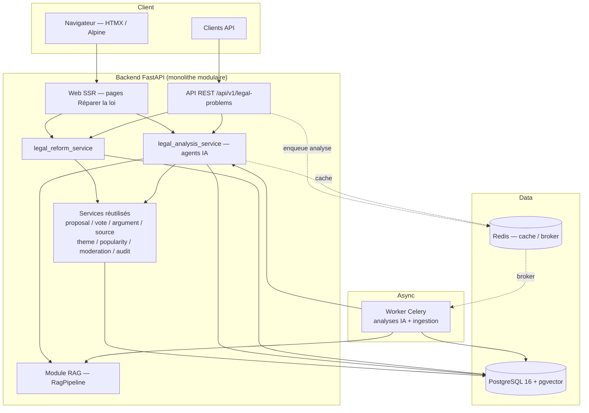
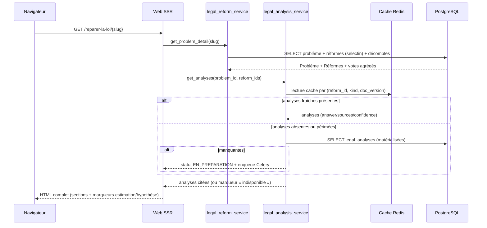
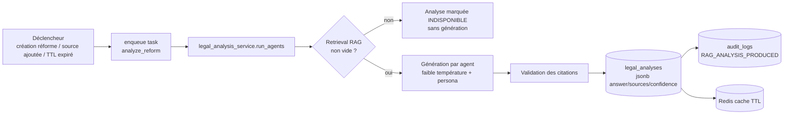
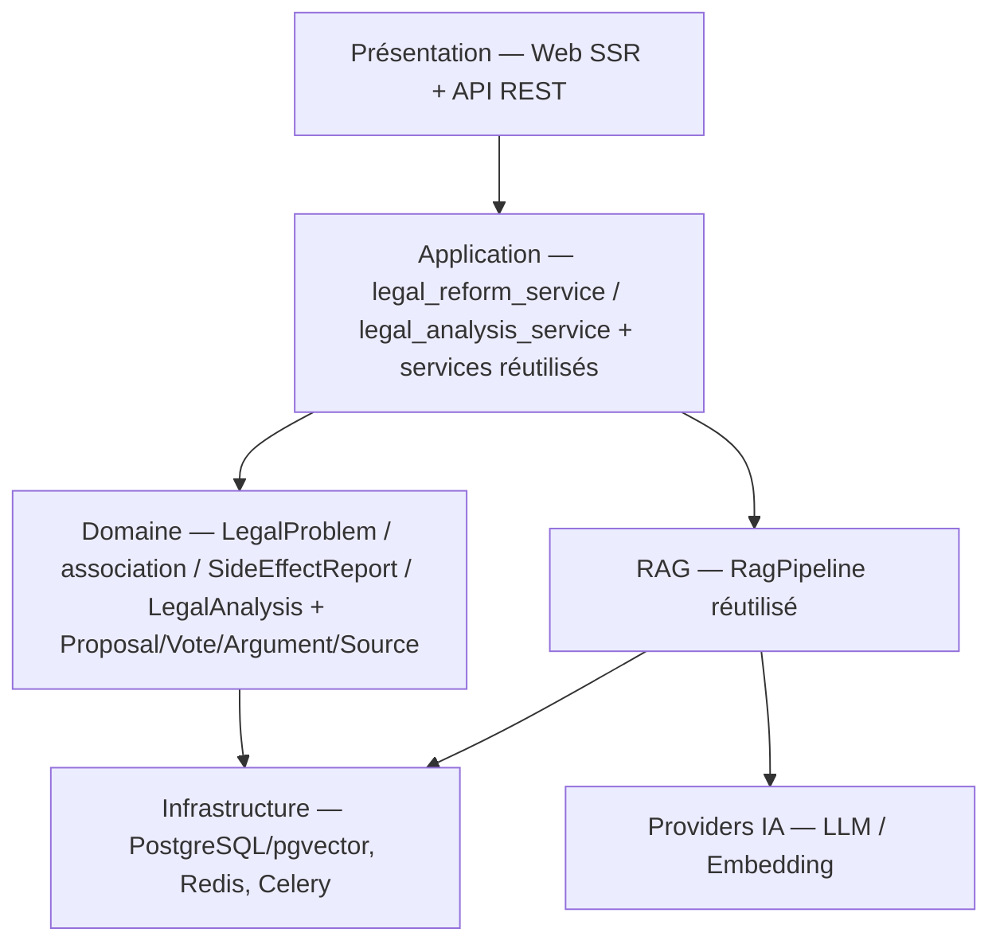
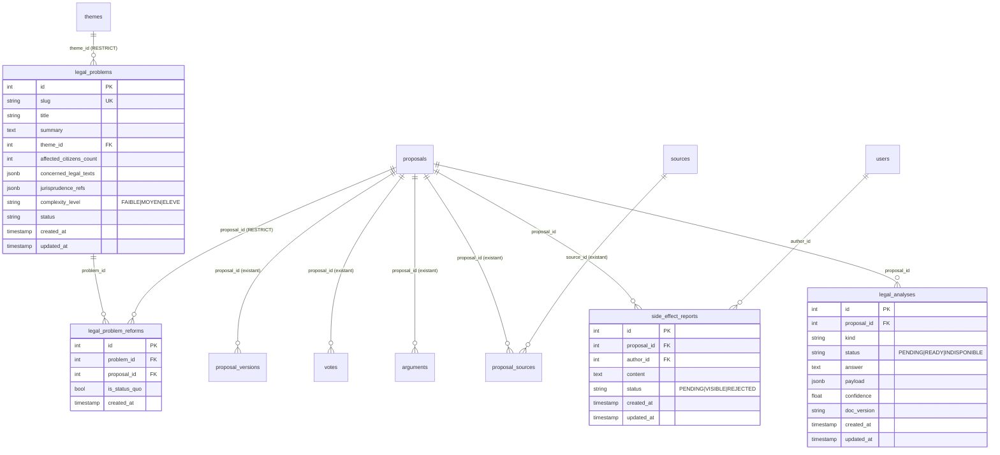

# Document de Conception — « Réparer la loi » (MVP)

## Overview

« Réparer la loi » est la première fonctionnalité applicative du MVP de PARTIPOLIA. Elle expose un
catalogue de **Problèmes Juridiques** concrets et, pour chacun, un parcours de compréhension puis de
délibération : analyse du droit en vigueur, comparaison de **Réformes Proposées** (options
législatives dont un statu quo), simulation des **Conséquences** par catégorie d'acteurs (« LoiLab »),
**Détection d'Effets Pervers**, **Agents IA Contradictoires** et **Conclusion Technique** agrégée,
**Vote Citoyen** réforme par réforme, et **Historique de Versions** de type Git.

**Principe directeur (Exigences 11, 12) :** l'IA **ne décide pas** et **ne vote pas**. Elle
**organise, documente et augmente** la capacité des citoyens à comprendre le droit. Toute analyse
produite **cite ses Sources juridiques** (Légifrance, jurisprudence, textes réglementaires via
`source_type = LEGISLATION`) et distingue explicitement le **problème réel** de la
**Simplification_Médiatique**.

### Choix structurant : réutilisation maximale, minimum de nouveaux éléments

La fonctionnalité **réutilise les fondations existantes** de `partipolia-platform` et n'introduit de
nouveaux éléments que là où l'existant ne suffit pas. Le tableau ci-dessous trace chaque concept de
« Réparer la loi » vers l'artefact retenu (Exigence 13).

| Concept de « Réparer la loi » | Artefact retenu | Nouveau ? | Exigence |
|---|---|---|---|
| Réforme_Proposée | Modèle `Proposal` existant | Non (réutilisé) | 13.1, 4.3 |
| Historique / Amendement | Modèle `ProposalVersion` existant | Non (réutilisé) | 13.5, 10.1 |
| Vote_Citoyen | Modèle `Vote` existant (±1/0, UPSERT) | Non (réutilisé) | 13.2, 8.1–8.4 |
| Prise de position | Modèle `Argument` existant (FOR/AGAINST) | Non (réutilisé) | 13.3, 13.4 |
| Source_Juridique | Modèles `Source`/`Document` (`LEGISLATION`) | Non (réutilisé) | 13.6, 12.5 |
| Analyse juridique / agents IA | Orchestration au-dessus de `RagPipeline` | Non (réutilisé) | 3, 5, 6, 7, 12 |
| Décomptes de votes | `popularity_service` existant | Non (réutilisé) | 9.1 |
| Modération des contributions | `moderation_service` existant | Non (réutilisé) | 15 |
| Journalisation | `audit_service` existant | Non (réutilisé) | 12.6, 15.3 |
| **Problème_Juridique** | **Nouveau modèle `LegalProblem`** | **Oui** | 1, 2 |
| **Rattachement Réforme↔Problème** | **Nouvelle association `legal_problem_reforms`** | **Oui** | 2.5, 4.1 |
| **Signalement_D_Effet_Secondaire** | **Nouveau modèle `SideEffectReport`** | **Oui** | 8.8 |
| **Résultats d'analyse IA persistés** | **Nouveau modèle `LegalAnalysis`** | **Oui** | 3, 5, 6, 7, 12.6 |
| **Orchestration métier** | **Nouveau `legal_reform_service`** | **Oui** | 4, 8, 9, 10, 13.8 |
| **Orchestration IA contradictoire** | **Nouveau `legal_analysis_service` (agents)** | **Oui** | 3, 5, 6, 7, 11 |

Aucun modèle redondant de proposition, de vote ou de source n'est créé : une Réforme_Proposée **est**
une `Proposal` (Exigence 13.1). Les seuls nouveaux modèles couvrent des concepts absents de la base
existante (le Problème_Juridique, son rattachement aux réformes, le signalement d'effet secondaire, et
la matérialisation des générations IA coûteuses).

### Stack

Aligné sur `partipolia-platform` : Python 3.13+, FastAPI, Pydantic v2, SQLAlchemy 2.x (style `Mapped`
typé, `relationship(lazy="selectin")`), Alembic, psycopg 3, PostgreSQL 16 + pgvector, Redis, Celery.
SSR Jinja2/HTMX/Alpine.js/Tailwind. API sous `/api/v1`. Interface et API en français.

---

## Architecture

### Positionnement dans le monolithe modulaire

« Réparer la loi » est un **module fonctionnel** du monolithe existant : de nouvelles routes Web/API,
deux nouveaux Services (`legal_reform_service`, `legal_analysis_service`) et de nouveaux modèles,
greffés sur les Services et le module RAG existants sans nouveau service d'infrastructure.



Le module IA (`legal_analysis_service`) est **en lecture seule côté domaine** : il consomme le
`RagPipeline` (SELECT sur `document_chunks`) et écrit **uniquement** dans la table de matérialisation
`legal_analyses` ; il n'émet jamais d'écriture vers `votes`, `proposals` ou `program_proposals`
(Exigences 11, 12 ; Property 10).

### Flux — consultation d'un Problème Juridique (SSR + analyses matérialisées)



### Flux — génération asynchrone des analyses IA (Celery)



Chaque **Agent_IA_Contradictoire** est une **invocation RAG spécialisée** (persona + focus
documentaire) exécutée hors-ligne par le worker, jamais dans le chemin HTTP synchrone : les
générations sont coûteuses (Exigence 12), donc **matérialisées** (voir Data Models `legal_analyses`)
et **mises en cache** (Redis). La récupération documentaire est **obligatoire avant génération** : si
le retrieval échoue ou est vide, l'agent est marqué indisponible sans invention (Exigences 3.5, 6.5,
7.10, 12.1). Chaque analyse produite est journalisée via `audit_service` (Exigences 12.6, 15.3).

### Modèle en couches



---

## Components and Interfaces

Les signatures sont logiques (Python 3.13, `Mapped`/Pydantic v2) et décrivent des contrats.

### Services (`app/services/`)

#### legal_reform_service (nouveau)

Orchestre le domaine « Réparer la loi » **sans dupliquer** les responsabilités existantes : il
**compose** `proposal_service`, `vote_service`, `argument_service`, `source_service`,
`theme_service`, `popularity_service`, `moderation_service` (Exigence 13.8).

```python
class LegalReformService:
    def __init__(self, session: AsyncSession) -> None: ...

    # Problèmes Juridiques (Exigences 1, 2)
    async def list_problems(self, *, page: int, limit: int) -> Page[LegalProblemSummary]: ...
    async def get_problem(self, problem_id: int) -> LegalProblemDetail: ...          # 404 si absent
    async def get_problem_by_slug(self, slug: str) -> LegalProblemDetail: ...
    async def create_problem(self, admin: User, data: LegalProblemCreate) -> LegalProblem: ...

    # Rattachement et cardinalité des Réformes (Exigences 2.5, 4.1, 4.2)
    async def attach_reform(self, admin: User, problem_id: int, proposal_id: int,
                            *, is_status_quo: bool) -> LegalProblemReform: ...
    async def list_reforms(self, problem_id: int) -> list[ReformView]: ...            # inclut statu quo
    def _validate_cardinality(self, reforms: list[LegalProblemReform]) -> None: ...   # 3..5 dont 1 statu quo

    # Vote citoyen (Exigences 8.1–8.4, 9) — délégué à vote_service + popularity_service
    async def cast_vote(self, user: User, problem_id: int, reform_id: int, value: int) -> VoteCounts: ...
    async def reform_vote_counts(self, problem_id: int, reform_id: int) -> VoteCounts: ...

    # Amendement (Exigences 8.7, 10) — délégué à proposal_service (ProposalVersion)
    async def propose_amendment(self, user: User, problem_id: int, reform_id: int,
                                data: AmendmentInput) -> ProposalVersion: ...
    async def list_versions(self, problem_id: int, reform_id: int) -> list[ProposalVersion]: ...

    # Prise de position (Exigences 13.3, 13.4) — délégué à argument_service
    async def submit_position(self, user: User, problem_id: int, reform_id: int,
                              position: str, content: str) -> Argument: ...           # FOR/AGAINST

    # Signalement d'effet secondaire (Exigences 8.8, 8.9, 15) — via moderation_service
    async def report_side_effect(self, user: User, problem_id: int, reform_id: int,
                                 content: str) -> SideEffectReport: ...
```

**Cardinalité (Exigence 4.1, 4.2) :** `_validate_cardinality` vérifie `3 ≤ len(reforms) ≤ 5` **et**
`count(is_status_quo) == 1` ; toute violation lève `ReformCardinalityError` (→ 422). Le
rattachement se fait via l'association `legal_problem_reforms` (voir Data Models) sans modifier
`Proposal`.

**Longueur des contributions (Exigence 8.9) :** amendement et signalement refusés si vides ou
> 5000 caractères (validation Pydantic), la saisie étant conservée côté formulaire.

**Décomptes (Exigence 9) :** `reform_vote_counts` délègue à `popularity_service`. La restitution de
« Réparer la loi » définit `participation_count = support_count + oppose_count` (Exigence 9.1) ; le
service existant inclut aussi le NEUTRE dans sa participation. La couche `legal_reform_service`
**expose donc explicitement** `participation_count = support_count + oppose_count` dans son schéma de
sortie `VoteCounts`, à partir de `support_count`/`oppose_count` renvoyés par `popularity_service`,
sans réimplémenter le calcul (Exigence 13.8). Aucun tri `ORDER BY vote_count` (Exigence 9.6).

#### legal_analysis_service (nouveau) — agents IA contradictoires

Orchestre les analyses IA **au-dessus de `RagPipeline`**, en **lecture seule** côté domaine. Chaque
agent est une invocation RAG spécialisée (persona + requête ciblée) ; les résultats sont matérialisés
et mis en cache.

```python
class AgentKind(str, Enum):
    ANALYSE_JURIDIQUE = "ANALYSE_JURIDIQUE"      # Exigence 3
    SIMULATION = "SIMULATION"                    # Exigence 5 (SimulationIA)
    EFFETS_PERVERS = "EFFETS_PERVERS"            # Exigence 6
    JURISTE = "JURISTE"                          # Exigence 7.2
    BUDGET = "BUDGET"                            # 7.3
    CONSTITUTION = "CONSTITUTION"                # 7.4
    IMPACT = "IMPACT"                            # 7.5
    OPPOSANT = "OPPOSANT"                        # 7.6
    DEFENSEUR = "DEFENSEUR"                      # 7.7

class LegalAnalysisService:
    def __init__(self, session: AsyncSession, pipeline: RagPipeline, audit: AuditService) -> None: ...

    # Lecture des analyses matérialisées (chemin HTTP synchrone) — jamais de génération en ligne
    async def get_analysis(self, reform_id: int, kind: AgentKind) -> AnalysisResult | Unavailable: ...
    async def get_reform_analyses(self, reform_id: int) -> ReformAnalysisBundle: ...   # agents + conclusion
    async def get_simulation(self, reform_id: int) -> SimulationResult | Unavailable: ...
    async def get_legal_analysis(self, problem_id: int) -> AnalysisResult | Unavailable: ...

    # Génération (worker Celery uniquement) — retrieval obligatoire avant génération
    async def run_agent(self, reform_id: int, kind: AgentKind) -> AnalysisResult | Unavailable: ...
    async def run_reform_agents(self, reform_id: int) -> ReformAnalysisBundle: ...
    def _aggregate_conclusion(self, analyses: list[AnalysisResult]) -> TechnicalConclusion: ...

    # Assistant conversationnel « demander une explication » (Exigence 8.5, 8.6)
    async def explain(self, user: User, problem_id: int, reform_id: int, question: str) -> ChatResponse: ...
```

**Personas et focus documentaire.** Chaque `AgentKind` porte un fragment de prompt persona ajouté au
`SYSTEM_PROMPT` du `RagPipeline` (qui impose déjà neutralité, anti-hallucination, distinction
faits/estimations/opinions/hypothèses/désaccords, interdiction de recommander un vote). Exemples :
JuristeIA → cohérence juridique ; BudgetIA → conséquences financières ; ConstitutionIA → risques
constitutionnels ; ImpactIA → effet sur les populations ; OpposantIA → failles ; DéfenseurIA →
meilleurs arguments favorables ; SimulationIA → effets par Catégorie_D_Acteur aux horizons 1/5/10 ans
(Exigences 5, 7.2–7.7).

**Récupération obligatoire (Exigences 3.5, 6.5, 7.10, 12.1).** `run_agent` appelle le `RagPipeline`,
qui exige un retrieval non vide avant génération. Si le pipeline renvoie
`INSUFFICIENT_INFORMATION` (aucun passage), l'agent est persisté avec `status = INDISPONIBLE`, sans
affirmation fabriquée. `run_reform_agents` produit la Conclusion_Technique à partir des seuls agents
disponibles (Exigence 7.10).

**Équilibre Défenseur/Opposant (Exigence 11.4, 11.5).** `_aggregate_conclusion` compte les arguments
produits par DéfenseurIA et OpposantIA ; si l'écart dépasse 1, le bundle tronque le côté excédentaire
au maximum `min(len)+1` avant restitution. Si un rôle n'a aucun argument documenté, la Conclusion
signale l'absence pour ce rôle sans fabriquer d'argument.

**Conclusion non prescriptive (Exigences 7.9, 11.1–11.3).** `_aggregate_conclusion` assemble une
synthèse descriptive et ne produit aucun verdict d'adoption/rejet ni recommandation de vote ; elle
préserve les marqueurs de catégorie (fait/estimation/opinion/hypothèse/désaccord) et les citations.

**Comparaison de réformes (Exigence 4.5–4.7).** `explain` avec une question comparative s'appuie sur
la classification `COMPARATIVE` du `RagPipeline` : comparaison sur objectif, procédure, coût estimé,
calendrier, effets documentés, contraintes juridiques, Sources et incertitudes ; information
manquante ⇒ « indisponible pour ce critère » ; aucun classement de préférence.

**Journalisation (Exigences 12.6, 15.3).** Toute analyse produite est consignée via `audit_service`
(`action = "RAG_ANALYSIS_PRODUCED"`, `entity_type = "LegalAnalysis"`, `new_data` = {reform_id, kind,
confidence, source_ids, doc_version}).

#### Services réutilisés (aucune modification de responsabilité — Exigence 13.8)

| Service existant | Rôle dans « Réparer la loi » |
|---|---|
| `proposal_service` | Création/lecture des Réformes_Proposées (`Proposal`), amendements via `ProposalVersion` (Exigences 13.1, 13.5, 10) |
| `vote_service` | Vote_Citoyen UPSERT ±1/0, unicité (proposal_id, user_id) (Exigences 13.2, 8.1–8.4) |
| `argument_service` | Prises de position FOR/AGAINST (Exigences 13.3, 13.4) |
| `source_service` | Rattachement des Sources_Juridiques (`LEGISLATION`) + ingestion (Exigences 13.6, 12.5) |
| `theme_service` | Rattachement `theme_id` du Problème_Juridique (Exigence 2.4) |
| `popularity_service` | Décomptes support/oppose (Exigence 9) |
| `moderation_service` | Modération des amendements et signalements (Exigence 15) |
| `audit_service` | Journalisation des analyses et décisions de modération (Exigences 12.6, 15.3) |

### API REST (`app/api/v1/legal_problems.py`, nouveau routeur)

### Web SSR (`app/web/`, nouvelles routes + templates)

Voir sections « REST API Design » et « Rendu Web (SSR) ».

---

## Data Models

### Nouveaux modèles

Trois modèles nouveaux, plus une table d'association. Aucun ne duplique un modèle existant.

#### `LegalProblem` (table `legal_problems`) — Exigences 1, 2

```python
class LegalProblem(TimestampMixin, Base):
    __tablename__ = "legal_problems"
    __table_args__ = (
        CheckConstraint(
            "complexity_level IN ('FAIBLE', 'MOYEN', 'ELEVE')",
            name="ck_legal_problems_complexity_level",
        ),
        CheckConstraint("affected_citizens_count >= 0", name="ck_legal_problems_affected_nonneg"),
    )

    id: Mapped[int] = mapped_column(primary_key=True)
    slug: Mapped[str] = mapped_column(String(255), unique=True, nullable=False, index=True)
    title: Mapped[str] = mapped_column(String(255), nullable=False)
    summary: Mapped[str] = mapped_column(Text, nullable=False)
    theme_id: Mapped[int] = mapped_column(
        ForeignKey("themes.id", ondelete="RESTRICT"), nullable=False, index=True,
    )
    affected_citizens_count: Mapped[int] = mapped_column(Integer, nullable=False, default=0)
    concerned_legal_texts: Mapped[list[str]] = mapped_column(JSONB, nullable=False, default=list)
    jurisprudence_refs: Mapped[list[str]] = mapped_column(JSONB, nullable=False, default=list)
    complexity_level: Mapped[str] = mapped_column(String(16), nullable=False)  # FAIBLE|MOYEN|ELEVE
    status: Mapped[str] = mapped_column(String(32), nullable=False, default="PUBLISHED")

    reform_links: Mapped[list["LegalProblemReform"]] = relationship(
        back_populates="problem", cascade="all, delete-orphan", lazy="selectin",
    )
```

`complexity_level` borné par CHECK à `{FAIBLE, MOYEN, ELEVE}` (Exigences 2.2, 2.3) ; `slug` UNIQUE et
`id` unique attribués à la création (Exigence 2.6) ; `theme_id` NOT NULL avec `ondelete=RESTRICT`
rattache à exactement un Thème (Exigence 2.4). Les textes de loi et références de jurisprudence sont
des listes JSONB (Exigence 2.1).

#### `LegalProblemReform` (table `legal_problem_reforms`) — Exigences 2.5, 4.1

**Décision de conception (rattachement Réforme↔Problème).** Deux options :

- **Option A — FK nullable `legal_problem_id` sur `proposals`.** Intrusive : modifie le modèle
  `Proposal` existant, y ajoute une colonne propre à une seule fonctionnalité et un marqueur
  `is_status_quo`, ce qui couple `Proposal` à « Réparer la loi » et complique la contrainte « une
  Proposal peut exister hors problème ».
- **Option B — table d'association `legal_problem_reforms`.** **Retenue.** La moins intrusive :
  `Proposal` reste inchangé (Exigence 13.1, aucune colonne ajoutée), le lien et l'attribut
  `is_status_quo` vivent dans la table de jointure, et la cardinalité 3–5 s'exprime sur les lignes de
  l'association. Une contrainte `UNIQUE(problem_id, proposal_id)` empêche les doublons et un index
  partiel `UNIQUE(problem_id) WHERE is_status_quo` garantit **au plus un** statu quo par problème.

```python
class LegalProblemReform(CreatedAtMixin, Base):
    __tablename__ = "legal_problem_reforms"
    __table_args__ = (
        UniqueConstraint("problem_id", "proposal_id", name="uq_lpr_problem_proposal"),
        Index(
            "uq_lpr_one_status_quo", "problem_id",
            unique=True, postgresql_where=text("is_status_quo"),
        ),
    )

    id: Mapped[int] = mapped_column(primary_key=True)
    problem_id: Mapped[int] = mapped_column(
        ForeignKey("legal_problems.id", ondelete="CASCADE"), nullable=False, index=True,
    )
    proposal_id: Mapped[int] = mapped_column(
        ForeignKey("proposals.id", ondelete="RESTRICT"), nullable=False, index=True,
    )
    is_status_quo: Mapped[bool] = mapped_column(Boolean, nullable=False, default=False)

    problem: Mapped["LegalProblem"] = relationship(back_populates="reform_links", lazy="selectin")
    proposal: Mapped["Proposal"] = relationship(lazy="selectin")
```

La règle « entre 3 et 5 réformes dont exactement 1 statu quo » (Exigences 4.1, 4.2) est appliquée par
`legal_reform_service._validate_cardinality` (règle métier), l'unicité du statu quo étant en plus
garantie par l'index partiel (défense en profondeur). `ondelete=RESTRICT` sur `proposal_id` empêche
de rompre un lien en supprimant une `Proposal` référencée.

#### `SideEffectReport` (table `side_effect_reports`) — Exigence 8.8

```python
class SideEffectReport(TimestampMixin, Base):
    __tablename__ = "side_effect_reports"
    __table_args__ = (
        CheckConstraint(
            "status IN ('PENDING', 'VISIBLE', 'REJECTED')",
            name="ck_side_effect_reports_status",
        ),
        CheckConstraint("char_length(content) <= 5000", name="ck_side_effect_reports_len"),
    )

    id: Mapped[int] = mapped_column(primary_key=True)
    proposal_id: Mapped[int] = mapped_column(
        ForeignKey("proposals.id", ondelete="CASCADE"), nullable=False, index=True,
    )
    author_id: Mapped[int] = mapped_column(
        ForeignKey("users.id", ondelete="CASCADE"), nullable=False, index=True,
    )
    content: Mapped[str] = mapped_column(Text, nullable=False)
    status: Mapped[str] = mapped_column(String(16), nullable=False, default="PENDING")

    proposal: Mapped["Proposal"] = relationship(lazy="selectin")
    author: Mapped["User"] = relationship(lazy="selectin")
```

Rattaché à la Réforme (`Proposal`) et à son auteur (Exigence 8.8). `status` reflète le résultat de la
modération (`PENDING` par défaut, `VISIBLE` si « acceptable », `REJECTED` si « interdit » — Exigence
15). La longueur ≤ 5000 caractères est validée en amont (Pydantic) et garantie par CHECK (Exigence
8.9).

#### `LegalAnalysis` (table `legal_analyses`) — matérialisation des analyses IA (Exigences 3, 5, 6, 7, 12.6)

**Décision de conception (cache/persistance des analyses).** Les analyses IA sont des générations
**coûteuses** (multiples appels RAG par réforme) et **rarement changeantes** (elles ne varient que si
le corpus documentaire de la réforme change). Deux mécanismes combinés :

- **Persistance en table `legal_analyses`** (source de vérité, auditable, ré-affichable sans coût) :
  chaque ligne stocke le résultat RAG (`answer`, `sources`, `confidence`) en JSONB, l'agent (`kind`),
  la version documentaire (`doc_version`) et un `status`. La restitution SSR/API lit cette table sans
  jamais générer en ligne.
- **Cache Redis** (TTL court) devant la table pour absorber les rafales de consultation d'une même
  page, invalidé par `(reform_id, kind, doc_version)`.

La **génération** est déclenchée hors-ligne (Celery) à la création d'une réforme, au rattachement
d'une nouvelle Source, ou à l'expiration d'un TTL de fraîcheur ; jamais dans le chemin HTTP
synchrone. Ce choix respecte « l'API n'est jamais bloquée » et « retrieval obligatoire avant
génération », tout en rendant les analyses auditables (Exigence 12.6).

```python
class LegalAnalysis(TimestampMixin, Base):
    __tablename__ = "legal_analyses"
    __table_args__ = (
        UniqueConstraint("proposal_id", "kind", name="uq_legal_analyses_proposal_kind"),
        CheckConstraint(
            "kind IN ('ANALYSE_JURIDIQUE','SIMULATION','EFFETS_PERVERS',"
            "'JURISTE','BUDGET','CONSTITUTION','IMPACT','OPPOSANT','DEFENSEUR')",
            name="ck_legal_analyses_kind",
        ),
        CheckConstraint(
            "status IN ('PENDING','READY','INDISPONIBLE')",
            name="ck_legal_analyses_status",
        ),
        CheckConstraint(
            "confidence >= 0 AND confidence <= 1", name="ck_legal_analyses_confidence_range",
        ),
    )

    id: Mapped[int] = mapped_column(primary_key=True)
    proposal_id: Mapped[int] = mapped_column(
        ForeignKey("proposals.id", ondelete="CASCADE"), nullable=False, index=True,
    )
    kind: Mapped[str] = mapped_column(String(32), nullable=False)
    status: Mapped[str] = mapped_column(String(16), nullable=False, default="PENDING")
    answer: Mapped[str | None] = mapped_column(Text, nullable=True)
    # payload structuré : sources[] {number, chunk_id, source_id, document_id, url},
    # markers[] (fait/estimation/opinion/hypothèse/désaccord), horizons (simulation), risks[] (effets pervers)
    payload: Mapped[dict[str, Any] | None] = mapped_column(JSONB, nullable=True)
    confidence: Mapped[float] = mapped_column(Float, nullable=False, default=0.0)
    doc_version: Mapped[str | None] = mapped_column(String(64), nullable=True)  # empreinte du corpus

    proposal: Mapped["Proposal"] = relationship(lazy="selectin")
```

`UNIQUE(proposal_id, kind)` : une analyse courante par réforme et par agent (régénération par UPSERT).
`SIMULATION` porte dans `payload` les effets par Catégorie_D_Acteur aux horizons 1/5/10 ans avec
marqueurs d'hypothèse (Exigences 5.2, 5.5) ; `EFFETS_PERVERS` porte `risks[]` avec contre-mesures et
marqueur « risque identifié » (Exigences 6.2, 6.3). Les Sources sont conservées dans `payload.sources`
pour l'affichage des liens Légifrance (Exigences 3.7, 12.5).

### Réutilisation sans modification

`Proposal`, `ProposalVersion`, `Vote`, `Argument`, `Source`, `ProposalSource`, `Document`,
`document_chunks`, `Theme` sont **réutilisés tels quels** — aucune migration ne les altère (Exigence
13). Une Réforme_Proposée est une `Proposal` (statut `PUBLISHED` typiquement) ; le statu quo est une
`Proposal` marquée `is_status_quo` dans l'association.

### Diagramme entité-relation (nouveaux éléments + points d'ancrage existants)



### Contraintes et index clés

- `legal_problems.slug` **UNIQUE** ; `complexity_level` CHECK ∈ `{FAIBLE, MOYEN, ELEVE}` (Exigences
  2.2, 2.3, 2.6) ; `theme_id` NOT NULL, `ondelete=RESTRICT` (Exigence 2.4).
- `legal_problem_reforms` : `UNIQUE(problem_id, proposal_id)` ; index partiel **`UNIQUE(problem_id)
  WHERE is_status_quo`** (au plus un statu quo — Exigences 2.5, 4.2) ; `proposal_id`
  `ondelete=RESTRICT`.
- `side_effect_reports` : `status` CHECK ∈ `{PENDING, VISIBLE, REJECTED}` ; `char_length(content) ≤
  5000` (Exigence 8.9).
- `legal_analyses` : `UNIQUE(proposal_id, kind)` ; `kind`/`status` bornés par CHECK ; `confidence ∈
  [0, 1]`.
- Toutes les `relationship` en `lazy="selectin"` (anti N+1), conformément à la convention existante.

### Migrations Alembic

Une révision Alembic **additive** (nouvelles tables uniquement, aucune altération de tables
existantes) :

1. `create table legal_problems` (+ CHECK complexity, + index slug).
2. `create table legal_problem_reforms` (+ FK, + `UNIQUE(problem_id, proposal_id)`, + index partiel
   statu quo).
3. `create table side_effect_reports` (+ CHECK status/longueur).
4. `create table legal_analyses` (+ CHECK kind/status/confidence, + `UNIQUE(proposal_id, kind)`).

`downgrade` supprime ces tables dans l'ordre inverse. Un script de seed amorce **≥ 10
Problèmes_Juridiques** avec, chacun, 3–5 réformes dont un statu quo (Exigences 1.2, 4.1).

---

## REST API Design

Nouveau routeur monté sous `/api/v1/legal-problems`. Codes : 200 OK, 201 Created, 202 Accepted
(analyse en préparation), 204 No Content, 401 non authentifié, 403 interdit, 404 introuvable, 422
validation, 429 rate limit. La pagination applique **taille par défaut 20, maximale 100** et renvoie
le **total** (Exigences 1.4, 14.1).

| Méthode | Chemin | Auth | Description | Codes |
|---|---|---|---|---|
| GET | `/legal-problems` | Non | Liste paginée des Problèmes_Juridiques (page, limit≤100, total) | 200 |
| GET | `/legal-problems/{id}` | Non | Détail d'un Problème_Juridique | 200, 404 |
| GET | `/legal-problems/{id}/reforms` | Non | Réformes_Proposées du problème (statu quo signalé) | 200, 404 |
| GET | `/legal-problems/{id}/analysis` | Non | Analyse_Juridique du droit actuel (matérialisée) | 200, 202, 404 |
| GET | `/legal-problems/{id}/reforms/{reform_id}/simulation` | Non | Simulation_De_Conséquences (1/5/10 ans) | 200, 202, 404 |
| GET | `/legal-problems/{id}/reforms/{reform_id}/analysis` | Non | Agents_IA + Conclusion_Technique | 200, 202, 404 |
| GET | `/legal-problems/{id}/reforms/{reform_id}/votes` | Non | Décomptes support/oppose/participation | 200, 404 |
| GET | `/legal-problems/{id}/reforms/{reform_id}/versions` | Non | Historique `ProposalVersion` (version croissante) | 200, 404 |
| POST | `/legal-problems/{id}/reforms/{reform_id}/votes` | Oui | Vote_Citoyen UPSERT {value ∈ +1/0/-1} | 200, 401, 422 |
| POST | `/legal-problems/{id}/reforms/{reform_id}/positions` | Oui | Prise de position FOR/AGAINST | 201, 401, 422 |
| POST | `/legal-problems/{id}/reforms/{reform_id}/amendments` | Oui | Amendement → nouvelle `ProposalVersion` | 201, 401, 422 |
| POST | `/legal-problems/{id}/reforms/{reform_id}/side-effects` | Oui | Signalement_D_Effet_Secondaire → modération | 201, 401, 422 |
| POST | `/legal-problems/{id}/reforms/{reform_id}/explain` | Oui | « Demander une explication » (RAG cité) | 200, 401, 404, 422 |

**Règles transversales (Exigence 14).**

- **404** si le Problème_Juridique, la Réforme_Proposée ou une sous-ressource désignée n'existe pas ;
  l'état de la Plateforme reste inchangé et aucun détail n'est retourné (Exigences 1.6, 5.7, 7.12,
  9.5, 10.5, 14.3).
- **401** pour toute requête modifiant l'état sans authentification valide (vote, position,
  amendement, signalement) ; l'état reste inchangé, y compris un Vote_Citoyen existant (Exigences
  8.10, 14.4).
- **422** pour un corps invalide (champ obligatoire absent, type incorrect, valeur hors bornes,
  longueur > 5000, `value ∉ {-1,0,+1}`, `position ∉ {FOR, AGAINST}`) ; la réponse énumère chaque
  champ en erreur et l'état reste inchangé (Exigences 8.9, 13.4, 14.5).
- **202** lorsqu'une analyse est demandée mais pas encore matérialisée (`status = PENDING`) : la
  réponse indique la préparation et l'API déclenche/entérine la tâche Celery sans bloquer. Un agent
  `INDISPONIBLE` est renvoyé en **200** avec un marqueur explicite d'indisponibilité (Exigences 3.5,
  6.5, 7.10).

Le modèle d'erreur JSON normalisé (`{error: {code, message, request_id, fields[]}}`) et le rate limit
sont ceux de `partipolia-platform` (réutilisés).

---

## Rendu Web (SSR)

Pages rendues **côté serveur** (HTML complet avant envoi) avec Jinja2, HTMX, Alpine.js, Tailwind, sans
authentification pour la consultation (Exigences 16.1, 16.6, 1.7).

| Route Web | Contenu |
|---|---|
| `/reparer-la-loi` | Liste des Problèmes_Juridiques : titre, résumé, nb de citoyens concernés, textes de loi, jurisprudence, Niveau_De_Complexité (Exigence 1.3) |
| `/reparer-la-loi/{slug}` | Page détail d'un problème (sections ci-dessous) |

**Sections de la page détail (Exigence 16.2).** Analyse_Juridique (problème réel vs
Simplification_Médiatique, citations numérotées), Réformes_Proposées **comparées côte à côte** (statu
quo signalé), Simulation_De_Conséquences « LoiLab » (grille Catégorie_D_Acteur × horizons 1/5/10 ans),
Détection_D_Effets_Pervers (risque + contre-mesure + marqueur « risque identifié »), Agents_IA
(Juriste/Budget/Constitution/Impact/Opposant/Défenseur/Simulation) + Conclusion_Technique
non prescriptive, décomptes de Votes_Citoyens (pourcentage **toujours** accompagné du nombre absolu —
Exigence 9.3), Sources_Juridiques citées avec **liens Légifrance/jurisprudence** (Exigences 12.5,
3.7).

**Marqueurs et états vides.**

- Toute valeur estimation/hypothèse porte un **marqueur textuel visible** (Exigences 5.5, 16.5).
- Les catégories fait/estimation/opinion/hypothèse/désaccord sont distinguées par un marqueur visible
  (Exigence 11.6).
- Une section sans donnée affiche un **libellé « aucun contenu »**, les autres sections restant
  disponibles (Exigence 16.3).
- Un problème introuvable/non chargeable affiche un message « contenu indisponible » **sans détail
  technique** (Exigence 16.7).

**Actions par réforme (fragments HTMX, Exigence 16.4).** Approuver, Rejeter, Proposer un amendement,
Demander une explication, Signaler un effet secondaire. Un utilisateur non authentifié qui tente une
action est invité à s'authentifier, sans altération d'état (Exigence 8.10).

**Hors périmètre (Exigence 17).** La Rubrique n'expose **aucun** accès au tableau de bord budgétaire
« Où va l'argent ? », au « programme citoyen complet » ni à une construction automatique de Programme
à partir des votes ; aucune agrégation des Votes_Citoyens de plusieurs réformes en une décision unique
(Exigences 17.1–17.5).

---

## Correctness Properties

_Une propriété est une caractéristique ou un comportement qui doit rester vrai pour toutes les
exécutions valides du système — une formulation formelle de ce que le système doit faire. Les
propriétés servent de pont entre les spécifications lisibles par un humain et des garanties de
correction vérifiables par machine. Chaque propriété ci-dessous est universellement quantifiée
(« pour tout / pour toute ») et destinée à des tests basés sur les propriétés (property-based
testing) exécutant au minimum 100 itérations par propriété, avec des Providers IA simulés (mocks)
pour les propriétés RAG afin d'isoler la logique du coût des appels externes._

Le périmètre PBT couvre la logique métier pure et les fonctions à contrat clair de « Réparer la loi »
(cardinalité des réformes, vote citoyen, versionnement, décomptes, validation de longueur, équilibre
des agents, découplage IA). Le rendu SSR, les points d'accès HTTP d'erreur (404/401/422), la
modération (réutilisée) et la journalisation d'audit sont couverts par des tests d'exemple/intégration
décrits dans la Testing Strategy.

### Property 1: Unicité et idempotence du Vote_Citoyen

_Pour tout_ couple (Utilisateur_Authentifié, Réforme_Proposée) et _pour toute_ séquence d'opérations
de vote dont les valeurs appartiennent à {+1, 0, -1}, il existe au plus une ligne de `Vote` pour ce
couple après application de la séquence, et sa valeur est égale à la dernière valeur soumise ; un
revote remplace la valeur sans créer d'enregistrement supplémentaire.

**Validates: Requirements 8.1, 8.2, 8.3, 8.4, 13.2**

### Property 2: participation_count = support_count + oppose_count

_Pour tout_ multiensemble de Votes_Citoyens de valeurs ∈ {+1, 0, -1} rattachés à une
Réforme_Proposée, le `participation_count` exposé par `legal_reform_service` est égal à la somme de
`support_count` (nombre de +1) et `oppose_count` (nombre de -1), les Votes NEUTRE (0) étant exclus de
ce décompte ; tout affichage d'un pourcentage de soutien s'accompagne du nombre absolu correspondant.

**Validates: Requirements 9.1, 9.3**

### Property 3: Cardinalité des Réformes_Proposées

_Pour toute_ configuration de Réformes_Proposées rattachées à un Problème_Juridique, la configuration
est acceptée si et seulement si le nombre de réformes appartient à l'intervalle [3, 5] **et** le
nombre de Réformes marquées `is_status_quo` est exactement 1 ; toute autre configuration est rejetée
par `_validate_cardinality` avec une erreur de cardinalité, l'état du Problème_Juridique restant
inchangé.

**Validates: Requirements 2.5, 4.1, 4.2**

### Property 4: Validation du Niveau_De_Complexité

_Pour toute_ chaîne soumise comme Niveau_De_Complexité d'un Problème_Juridique, l'enregistrement est
accepté si et seulement si la chaîne appartient à l'ensemble {FAIBLE, MOYEN, ELEVE} ; toute autre
valeur est refusée avec une indication d'erreur, sans création ni modification du Problème_Juridique.

**Validates: Requirements 2.2, 2.3**

### Property 5: Unicité de l'identifiant et du slug d'un Problème_Juridique

_Pour toute_ séquence de créations de Problèmes_Juridiques (y compris avec des titres identiques),
tous les identifiants attribués sont distincts et tous les slugs attribués sont distincts.

**Validates: Requirements 2.6**

### Property 6: Bornes de longueur des Amendements et Signalements

_Pour toute_ chaîne soumise comme texte d'un Amendement ou d'un Signalement_D_Effet_Secondaire,
l'enregistrement est accepté si et seulement si la longueur de la chaîne (après normalisation) est
comprise entre 1 et 5000 caractères inclus ; une chaîne vide ou de plus de 5000 caractères est
refusée sans modification d'état.

**Validates: Requirements 8.9**

### Property 7: Versionnement monotone et historique immuable

_Pour toute_ Réforme_Proposée et _pour toute_ séquence de N Amendements valides, l'attribut `version`
croît strictement de manière monotone et vaut `version_initiale + N` ; chaque Amendement produit une
nouvelle `ProposalVersion` (jamais un écrasement) portant `snapshot`, `change_summary` et `edited_by`
et incrémentant la version d'exactement 1 ; l'ensemble des snapshots antérieurs demeure inchangé.

**Validates: Requirements 8.7, 10.2, 10.3, 13.5**

### Property 8: Ordre croissant de l'historique des versions

_Pour tout_ historique de Versions_De_Proposition d'une Réforme_Proposée, la liste retournée par
`list_versions` est ordonnée par numéro de version strictement croissant.

**Validates: Requirements 10.4**

### Property 9: Pagination bornée et total exact

_Pour tout_ nombre N de Problèmes_Juridiques et _pour toute_ demande (page, limit), la liste retournée
comporte au plus `min(limit, 100)` éléments, et le total renvoyé est égal à N.

**Validates: Requirements 1.4, 14.1**

### Property 10: Découplage IA — non-écriture dans les tables de décision

_Pour toute_ Réforme_Proposée et _pour tout_ contexte documentaire, l'exécution des Agents_IA
(`run_agent`, `run_reform_agents`) et de l'Assistant conversationnel n'émet aucune écriture
(INSERT/UPDATE/DELETE) vers les tables `votes`, `proposals` ou `program_proposals` ; les seules
écritures autorisées visent la table de matérialisation `legal_analyses` et le Journal_D_Audit.

**Validates: Requirements 11.1, 11.2, 11.3, 12.1**

### Property 11: Récupération obligatoire avant génération

_Pour toute_ demande d'analyse (Analyse_Juridique, Simulation, Détection_D_Effets_Pervers, ou tout
Agent_IA_Contradictoire), si l'étape de récupération documentaire du Pipeline_RAG ne retourne aucun
passage, alors aucune génération LLM n'est effectuée, l'analyse est marquée `INDISPONIBLE`, et aucune
référence de loi, de jurisprudence ou de nombre absent du contexte n'est produite.

**Validates: Requirements 3.4, 3.5, 3.6, 6.5, 7.10, 12.1**

### Property 12: Ancrage documentaire des affirmations juridiques

_Pour tout_ contexte documentaire non vide, toute Affirmation_Juridique importante de l'analyse
générée renvoie à au moins une Source_Juridique présente dans le contexte ; toute affirmation non
associée à une Source est détectée et n'est pas présentée comme établie, ce qui abaisse la confiance
restituée.

**Validates: Requirements 3.3, 12.3, 12.4**

### Property 13: Température de génération bornée

_Pour toute_ valeur de température transmise à la génération d'une analyse, la température effective
utilisée par le Pipeline_RAG appartient à l'intervalle [0.0, 0.3].

**Validates: Requirements 12.2**

### Property 14: Complétude des horizons de la Simulation

_Pour toute_ Simulation_De_Conséquences produite et _pour toute_ Catégorie_D_Acteur énumérée, la
simulation fournit exactement un effet projeté à chacun des horizons 1 an, 5 ans et 10 ans.

**Validates: Requirements 5.2, 5.3**

### Property 15: Présence des marqueurs de catégorie

_Pour tout_ effet reposant sur une hypothèse, _pour tout_ risque de la Détection_D_Effets_Pervers, et
_pour tout_ énoncé d'analyse, le payload restitué porte un marqueur visible correspondant : marqueur
d'hypothèse/estimation pour les valeurs projetées, marqueur « risque identifié » pour chaque risque,
et marqueur de catégorie (fait / estimation / opinion / hypothèse / désaccord) pour les énoncés.

**Validates: Requirements 5.5, 6.3, 11.6, 16.5**

### Property 16: Chaque risque possède au moins une contre-mesure

_Pour toute_ Détection_D_Effets_Pervers produite, chaque risque identifié est accompagné d'au moins
une contre-mesure possible.

**Validates: Requirements 6.2**

### Property 17: Équilibre DéfenseurIA / OpposantIA

_Pour toute_ paire d'ensembles d'arguments produits par DéfenseurIA et OpposantIA, la restitution
garantit que l'écart entre le nombre d'arguments exposés de chaque rôle n'excède pas 1 ; si un rôle ne
dispose d'aucun argument documenté, l'absence est signalée pour ce rôle et aucun argument n'est
fabriqué.

**Validates: Requirements 11.4, 11.5**

### Property 18: Conclusion_Technique non prescriptive

_Pour toute_ liste d'analyses d'Agents_IA_Contradictoires, la Conclusion_Technique agrégée ne comporte
aucun champ de recommandation d'adoption ou de rejet, aucune recommandation de vote et aucun
classement des Réformes_Proposées par ordre de préférence.

**Validates: Requirements 4.7, 7.9, 11.1, 11.2, 11.3**

---

## Error Handling

### Modèle d'erreur de l'API

« Réparer la loi » réutilise le gestionnaire global d'exceptions et le corps JSON normalisé de
`partipolia-platform`, corrélé par `X-Request-ID` :

```json
{
  "error": {
    "code": "VALIDATION_ERROR",
    "message": "Le corps de la requête est invalide.",
    "request_id": "…",
    "fields": [{ "field": "value", "message": "doit appartenir à {-1, 0, 1}" }]
  }
}
```

| Code | `code` | Déclencheur « Réparer la loi » | Exigences |
|---|---|---|---|
| 401 | `UNAUTHENTICATED` | Vote/position/amendement/signalement sans JWT valide ; état (dont Vote existant) inchangé | 8.10, 14.4 |
| 403 | `FORBIDDEN` | Action réservée (ex. modération, création de problème par non-Administrateur) | 15 |
| 404 | `NOT_FOUND` | Problème/Réforme/sous-ressource inexistant ; aucun détail retourné, état inchangé | 1.6, 5.7, 7.12, 9.5, 10.5, 14.3 |
| 422 | `VALIDATION_ERROR` | Corps invalide : champ manquant, type incorrect, `value ∉ {-1,0,1}`, `position ∉ {FOR,AGAINST}`, longueur > 5000, complexité invalide ; champs fautifs énumérés | 2.3, 8.9, 13.4, 14.5 |
| 429 | `RATE_LIMITED` | Débit dépassé (`Retry-After`) ; protection renforcée des endpoints IA (`explain`) | (réutilisé) |

### Cardinalité et configuration des réformes

Une configuration violant la cardinalité (hors [3,5] ou nombre de statu quo ≠ 1) est rejetée par
`ReformCardinalityError` → 422, sans altérer le Problème_Juridique (Exigence 4.2). L'index partiel
`UNIQUE(problem_id) WHERE is_status_quo` fournit une défense en profondeur contre un second statu quo.

### Échecs du Pipeline RAG et des analyses IA

- **Retrieval vide ou en échec** : l'analyse concernée est marquée `INDISPONIBLE` sans génération ;
  la Conclusion_Technique est produite à partir des seuls agents disponibles ; l'interface affiche
  « analyse momentanément indisponible » (Exigences 3.5, 6.5, 7.10).
- **Affirmations non sourcées** : détectées par le `CitationValidator` (réutilisé), retirées ou
  dégradées, la confiance étant abaissée (Exigences 3.3, 12.3, 12.4).
- **Information manquante pour un critère de comparaison** : « indisponible pour ce critère », sans
  inférence de valeur (Exigence 4.6).
- **Analyse non encore matérialisée** : réponse 202 « en préparation » + tâche Celery, sans blocage
  de l'API.
- **Erreurs/timeouts de Provider** : réponse dégradée neutre, journalisée par `request_id`, sans
  détail interne.

### Rattachement de Source_Juridique

Un échec du Pipeline_D_Ingestion lors du rattachement d'une Source laisse la Réforme_Proposée
inchangée et retourne une erreur signalant l'échec du rattachement (Exigence 13.7).

### Modération et indisponibilité

Amendements et Signalements passent par `moderation_service` : « acceptable » → `VISIBLE` +
notification ; « douteux » → File_De_Modération (`PENDING`), non publié ; « interdit » → `REJECTED`,
contenu conservé, auteur notifié du motif ; indisponibilité du moteur → `PENDING` + audit de l'échec
(Exigences 15.1–15.6). Chaque décision est consignée dans le Journal_D_Audit (Exigence 15.3).

### Rendu SSR défensif

Une section sans donnée affiche un libellé « aucun contenu » sans masquer les autres sections
(Exigence 16.3) ; un problème introuvable/non chargeable affiche « contenu indisponible » sans
exposer de détail technique interne (Exigence 16.7).

---

## Testing Strategy

### Approche duale

- **Tests unitaires** : exemples concrets, cas limites et conditions d'erreur des Services et du
  rendu.
- **Tests basés sur les propriétés (PBT)** : vérifient les propriétés universelles de la section
  Correctness Properties sur un large espace d'entrées.

### Outillage (aligné sur l'existant du dépôt)

- **pytest** et **pytest-asyncio** (déjà présents) pour les tests synchrones et asynchrones.
- **Hypothesis** (déjà présent — cf. `tests/unit/*_property.py`) pour les tests de propriété ; aucune
  implémentation PBT « maison ».
- **ruff** et **mypy** en intégration continue, comme pour le reste du dépôt.

### Tests unitaires / d'intégration par composant

| Composant | Cibles de test |
|---|---|
| `legal_reform_service` | Cardinalité 3–5/1 statu quo, rattachement via association, délégation vote/version/position, longueurs 8.9 |
| `legal_analysis_service` | Retrieval obligatoire (mock vide → INDISPONIBLE), équilibre Défenseur/Opposant, conclusion non prescriptive, audit par analyse |
| API `/legal-problems` | Pagination (défaut 20/max 100/total), 404 ressources absentes, 401 sans auth, 422 corps invalides, 202 analyse en préparation |
| Web SSR | Sections présentes, marqueurs estimation/hypothèse/risque, libellé « section vide », 404 sans détail, absence des fonctionnalités hors-périmètre (Exigence 17) |
| `moderation_service` (réutilisé) | Mapping décision → statut `VISIBLE`/`PENDING`/`REJECTED`, entrée d'audit (Exigence 15) |

### Tests basés sur les propriétés

Chaque propriété est implémentée par **un unique** test Hypothesis, configuré à **≥ 100 itérations**,
avec Providers IA simulés pour les propriétés RAG. Chaque test porte une étiquette référençant la
propriété :

```
# Feature: repair-the-law, Property 3: Cardinalité des Réformes_Proposées
```

Correspondance propriété → cible de test :

| Propriétés | Cible |
|---|---|
| 1, 2 | `legal_reform_service` (vote via `vote_service` + `popularity_service`) |
| 3, 5, 6 | `legal_reform_service` (cardinalité, unicité slug, longueurs) |
| 4 | validation `LegalProblemCreate` / `create_problem` |
| 7, 8 | `legal_reform_service` / `proposal_service` (versions) |
| 9 | routeur `/legal-problems` (pagination) |
| 10, 11, 12, 13 | `legal_analysis_service` + `RagPipeline` (mocks) |
| 14, 15, 16, 17, 18 | `legal_analysis_service` (payloads Simulation/Effets Pervers, agrégation) |

### Tests d'exemple (non property-testables)

404 sur identifiants inexistants (Exigences 1.6, 5.7, 7.12, 9.5, 10.5) ; 401 sans authentification
(Exigences 8.10, 14.4) ; mapping de modération (Exigence 15) ; journalisation d'audit (Exigences 12.6,
15.3) ; absence d'accès aux fonctionnalités hors-périmètre (Exigence 17) ; rendu des marqueurs et
libellés d'état vide (Exigence 16).

### Évaluation du RAG (dataset)

Le jeu d'évaluation RAG de `partipolia-platform` est étendu avec des entrées **juridiques**
(questions sur le droit en vigueur, `expected_citations` renvoyant à des Sources `LEGISLATION`) afin
de mesurer la précision/rappel de récupération, l'exactitude des citations et l'ancrage des réponses
pour les analyses de « Réparer la loi », validant les garde-fous anti-hallucination (Exigence 12) et
complétant les Property 11 et 12.
