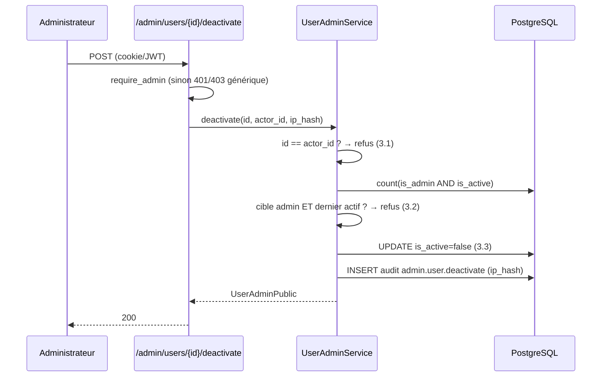
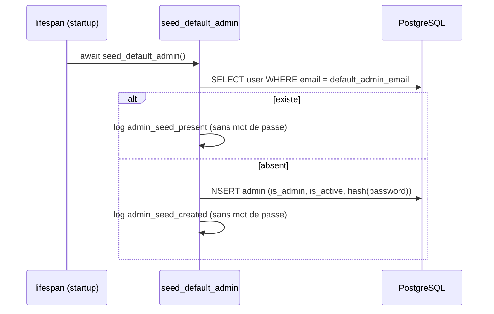

# Document de Conception — Administration des Utilisateurs & SSO

## Overview

_Introduction et vue d'ensemble_

Cette conception détaille la mise en œuvre des quatre manques fonctionnels décrits dans `requirements.md` : administration des Utilisateurs (API + page), contrôle d'accès des pages Web SSR, amorçage idempotent d'un Administrateur par défaut, et connexion SSO (LinkedIn, Google, Facebook). Elle **prolonge** le socle d'authentification existant (`AuthService`, `deps.py`, cookies HttpOnly, `AuditLog`) sans le redéfinir : les nouveaux composants réutilisent `hash_password`, `_issue_token_pair`, `_normalize_email`, `AuthError`, les aides de cookies `_set_access_cookie` / `_set_refresh_cookie`, `require_admin`, `default_rate_limit` et `AuditService`.

Décision d'identité **confirmée par l'utilisateur** : l'Administrateur_Par_Defaut est un compte **fondé sur l'email**. Le « login admin » demandé se traduit par un compte d'email `admin@partipolia.local` (configurable) et de `display_name` `admin`. **Aucune colonne `username` n'est ajoutée** au modèle `User` ; le schéma d'identité reste `email`-centrique, cohérent avec `AuthService`.

## Architecture

_Vue d'ensemble et architecture_

L'application est un monolithe modulaire FastAPI (Exigence 33.1) : API REST sous `/api/v1`, pages Web SSR à la racine, couche de Services async, PostgreSQL (SQLAlchemy 2.x async) et Redis (sessions révoquées, rate limit, `state`/`nonce` SSO). Les nouveaux composants s'insèrent dans les couches existantes sans en créer de nouvelle :

```
app/
├── core/
│   ├── config.py          (+ champs admin par défaut + config SSO)
│   ├── security.py         (NOUVEAU) helper hash_client_ip + génération mot de passe inutilisable
│   └── seed.py             (NOUVEAU) seed_default_admin (appelé par lifespan)
├── models/
│   └── user.py            (+ colonne nullable sso_provider ; password_hash reste non nul)
├── schemas/
│   ├── admin_user.py       (NOUVEAU) AdminUserCreate, UserAdminPublic
│   └── sso.py              (NOUVEAU) SsoProfile (DTO interne)
├── services/
│   ├── user_admin_service.py  (NOUVEAU) create/list/activate/deactivate + garde-fous + audit
│   └── sso_service.py         (NOUVEAU) flux OAuth + provisionnement/rattachement
├── api/
│   ├── deps.py            (réutilisé tel quel)
│   └── v1/
│       ├── admin_users.py  (NOUVEAU) /api/v1/admin/users, protégé require_admin
│       └── auth_sso.py     (NOUVEAU) /api/v1/auth/sso/{provider}/login + /callback
├── web/
│   ├── deps.py             (NOUVEAU) require_page_auth / require_page_admin (redirections SSR)
│   └── router.py          (+ page /admin/utilisateurs)
└── main.py                (lifespan: appelle seed_default_admin au démarrage)
```

Le flux SSO passe par des **routes web** (et non purement API) car il repose sur des redirections navigateur et le dépôt de cookies HttpOnly : la route `/callback` réutilise `_set_access_cookie` / `_set_refresh_cookie` puis redirige vers une page. Les routes sont montées sous `/api/v1/auth/sso` pour cohérence de nommage avec le reste de l'authentification, mais renvoient des `RedirectResponse` porteuses de cookies.

## Data Models

_Modèle de données_

### Décision : rattachement SSO par email vérifié (pas de table d'identités)

Conformément à l'Exigence 9.2, le Rattachement_SSO se fait **par email vérifié**, sans table de liaison `sso_identities`. Justification : l'`email` est déjà `UNIQUE` sur `users` et sert de clé d'identité unique dans tout `AuthService`. Ajouter une table d'identités par fournisseur introduirait une seconde clé d'identité et une complexité de réconciliation non exigée.

**Compromis / risque de collision assumé** : un même email peut être présenté par plusieurs fournisseurs. Comme le rattachement est fondé sur l'email vérifié, deux fournisseurs distincts rapportant le même email vérifié rattacheront au même Utilisateur — comportement voulu (identité unique, Exigence 9.2). Le risque résiduel — un fournisseur affirmant à tort un email vérifié — est **atténué** par l'Exigence 9.3 (refus si `email_verified` est faux) : seule la vérification d'email du fournisseur autorise provisionnement et rattachement. Ce compromis est documenté ici pour une éventuelle évolution ultérieure vers une table d'identités si un besoin multi-fournisseurs strict apparaît.

### Colonnes du modèle `User`

| Colonne | Type | Nullable | Décision |
|---|---|---|---|
| `email` | `String(255)` UNIQUE | non | Inchangé — clé d'identité (Exigence 1.1) |
| `password_hash` | `String(255)` | **non (inchangé)** | Reste non nul. Le SSO stocke un **hachage inutilisable** (mot de passe aléatoire haché argon2), pas `NULL` |
| `display_name` | `String(120)` | non | Inchangé |
| `is_active` / `is_verified` / `is_admin` | `Boolean` | non | Inchangés |
| `consents` | `JSONB` | non | Inchangé — initialisé `{}` au provisionnement SSO (Exigence 10.2) |
| `sso_provider` | `String(32)` | **oui (NOUVEAU)** | Enregistre le dernier Fournisseur_SSO ayant provisionné/rattaché le compte ; `NULL` pour un compte créé par mot de passe |

Décision `password_hash` : **rester NON nul** avec un hachage inutilisable plutôt que rendre la colonne nullable. Cela évite de propager des vérifications `None` dans `authenticate` / `verify_password` et garantit qu'un compte SSO ne peut jamais se connecter par mot de passe (le mot de passe aléatoire n'est jamais communiqué). C'est aussi ce que prescrit l'Exigence 9.1 (« `password_hash` aléatoire inutilisable »).

### Migration Alembic `0003_user_sso_provider`

Suit la convention des migrations `0001`/`0002` (docstring avec Exigences, `revision`/`down_revision`, `op.add_column` / `op.drop_column`, réversibilité complète — Exigence 32.4).

```python
def upgrade() -> None:
    op.add_column(
        "users",
        sa.Column("sso_provider", sa.String(length=32), nullable=True),
    )

def downgrade() -> None:
    op.drop_column("users", "sso_provider")
```

`down_revision = "0002_user_consents"`. Aucune donnée de profilage n'est ajoutée (cohérence Exigences 28.1, 28.2, 10.1).

## Components and Interfaces

_Composants nouveaux et modifiés_

### 1. Schémas Pydantic (`app/schemas/admin_user.py`)

Aucun schéma n'expose jamais `password_hash` (Exigences 1.4, 4.3).

```python
class AdminUserCreate(BaseModel):
    email: EmailStr
    display_name: str = Field(min_length=1, max_length=120)
    password: str = Field(min_length=8, max_length=256)
    is_admin: bool = False

class UserAdminPublic(BaseModel):        # sortie liste/création
    model_config = ConfigDict(from_attributes=True)
    id: int
    email: EmailStr
    display_name: str
    is_active: bool
    is_verified: bool
    is_admin: bool
```

`UserAdminPublic` reprend exactement les champs autorisés par l'Exigence 4 (`id`, `email`, `display_name`, `is_active`, `is_verified`, `is_admin`), sans horodatages inutiles ni `password_hash`.

### 2. `UserAdminService` (`app/services/user_admin_service.py`)

Instancié par requête avec une `AsyncSession` ; réutilise `AuthService` (pour `hash_password` et `_normalize_email`) et `AuditService`. Lève une exception dédiée `UserAdminError` (message générique) traduite en HTTP par le routeur.

Contrat :

```python
class UserAdminError(Exception): ...   # message générique, pas d'énumération

class UserAdminService:
    def __init__(self, session, *, audit=None, auth=None): ...

    async def create_user(self, data: AdminUserCreate, *, actor_id: int,
                          ip_hash: str | None) -> User: ...
    async def list_users(self) -> list[User]: ...
    async def activate(self, user_id: int, *, actor_id: int,
                       ip_hash: str | None) -> User: ...
    async def deactivate(self, user_id: int, *, actor_id: int,
                         ip_hash: str | None) -> User: ...
```

Règles :
- **create_user** (Exigences 1.1, 1.7) : normalise l'email, contrôle l'unicité applicative puis s'appuie sur la contrainte `UNIQUE` (course concurrente) ; email déjà pris ⇒ `UserAdminError` **générique** sans révéler l'existence (Exigence 1.7). Crée avec `is_active=True`, `is_admin` selon la demande, `password_hash = auth.hash_password(password)`, `consents={}`. Consigne l'audit `admin.user.create`.
- **list_users** (Exigence 4) : `SELECT` de tous les Utilisateurs, projeté en `UserAdminPublic`.
- **activate** (Exigence 5) : `is_active=True` ; audit `admin.user.activate`.
- **deactivate** (Exigences 6, 3) : applique les **deux** garde-fous avant toute écriture :
  1. si `user_id == actor_id` ⇒ refus (Exigence 3.1), `is_active` inchangé ;
  2. si la cible est Administrateur **et** qu'elle est le dernier Administrateur `is_active=True` ⇒ refus (Exigence 3.2). Le décompte se fait par `SELECT count(*) FROM users WHERE is_admin AND is_active` ; refus si le compte vaut 1 et que la cible en fait partie ;
  3. sinon `is_active=False` (Exigence 3.3) ; audit `admin.user.deactivate`.

Effet de la désactivation (Exigence 2) : **aucun code nouveau**. Les gardes existantes `authenticate`, `refresh` et `current_user` rejettent déjà `not user.is_active`. La conception se contente de le documenter et de le couvrir par des tests.

Audit (Exigence 4) : chaque action appelle `AuditService.record(action=..., entity_type="user", entity_id=<cible>, new_data=<champs non sensibles>, ip_hash=<empreinte>)`. `old_data`/`new_data` ne contiennent **jamais** de mot de passe ni de `password_hash` (Exigence 4.3) — seuls `email`, `display_name`, `is_admin`, `is_active` y figurent.

### 3. API d'administration (`app/api/v1/admin_users.py`)

Routeur monté sous `/api/v1/admin/users`, protégé par `require_admin` au niveau du routeur (`dependencies=[Depends(require_admin)]`) et limité en débit par `default_rate_limit("admin_users")`.

| Méthode & chemin | Rôle | Exigences |
|---|---|---|
| `POST /admin/users` | Créer un Utilisateur | 1.1, 1.7 |
| `GET /admin/users` | Lister les Utilisateurs | 4 |
| `POST /admin/users/{id}/activate` | Activer | 5 |
| `POST /admin/users/{id}/deactivate` | Désactiver (garde-fous) | 3, 6 |

Codes de réponse : `401` générique pour non authentifié (via `get_access_token`/`get_current_user`, Exigence 1.2), `403` générique pour authentifié non Administrateur (via `require_admin`, Exigence 1.3), `400` générique pour email déjà pris ou garde-fou violé (Exigences 1.7, 3), `429` sur dépassement de débit. Le routeur dérive `ip_hash` de la requête via `hash_client_ip(request)` (voir §7) et le passe au Service ; il enregistre dans l'API v1 via `api_router.include_router(admin_users.router, prefix="/admin/users", tags=["admin-users"])`.

### 4. Service SSO (`app/services/sso_service.py`) et abstraction de fournisseur

**Abstraction de fournisseur** — un protocole décrivant un Fournisseur_SSO OAuth2/OIDC :

```python
@dataclass(frozen=True)
class SsoProviderConfig:
    name: str                 # "google" | "linkedin" | "facebook"
    client_id: str
    client_secret: SecretStr
    redirect_uri: str
    authorize_url: str
    token_url: str
    userinfo_url: str
    scopes: tuple[str, ...]
    uses_oidc: bool           # Google/LinkedIn OIDC → nonce ; Facebook OAuth2 → sans nonce

class SsoProfile(BaseModel):  # DTO interne minimal (Exigence 10.1)
    email: EmailStr
    display_name: str
    email_verified: bool
```

Seuls Google, LinkedIn et Facebook sont pris en charge ; un fournisseur sans `client_id`/`client_secret` est **désactivé** (Exigence 7.3) et sa route de connexion renvoie `404`.

**Service** :

```python
class SsoError(Exception): ...   # message générique (Exigences 8.3, 8.5, 9.5)

class SsoService:
    def __init__(self, session, *, redis=None, auth=None, audit=None,
                 http_client=None, config=None): ...

    async def begin_login(self, provider: str) -> str:
        """Génère state (+ nonce si OIDC), les stocke en Redis avec TTL,
        retourne l'URL d'autorisation du fournisseur (Exigence 8.1)."""

    async def complete_login(self, provider: str, *, code: str, state: str
                            ) -> tuple[TokenPair, User]:
        """Vérifie le state (Exigences 8.2, 8.3), échange le code (8.4),
        récupère le profil, provisionne/rattache (9.x), émet le Couple_De_Jetons (9.4)."""
```

`state`/`nonce` : chaîne aléatoire (`secrets.token_urlsafe`) stockée sous `sso:state:{state}` en Redis avec TTL (ex. 600 s) et valeur `{provider, nonce}`. À usage unique : la clé est supprimée (`GETDEL`) lors de la validation, empêchant la réutilisation (Exigence 8.3). Un `state` absent, inconnu, expiré ou déjà consommé ⇒ `SsoError` générique.

Échange de code et profil (Exigence 8.4) : POST vers `token_url` avec `code`, `redirect_uri`, `client_id`, `client_secret` via un client HTTP async (`httpx.AsyncClient`) ; pour un fournisseur OIDC, le `nonce` de l'`id_token` est vérifié contre celui stocké. Le profil (`email`, `display_name`, `email_verified`) est lu depuis `userinfo_url` (ou les claims de l'`id_token`). Tout échec (réseau, code invalide, profil incomplet) ⇒ `SsoError` générique sans divulguer la cause (Exigence 8.5).

Provisionnement/rattachement (Exigence 9) :
- email **non vérifié** par le fournisseur ⇒ refus (Exigence 9.3) ;
- email vérifié **sans** Utilisateur correspondant ⇒ provisionnement : `email` normalisé (`_normalize_email`), `display_name` du fournisseur, `is_active=True`, `is_admin=False`, `is_verified=<email_verified>`, `password_hash = generate_unusable_password_hash()` (mot de passe aléatoire haché, jamais communiqué), `consents={}` (Exigences 9.1, 10.2), `sso_provider=<provider>` ;
- email vérifié **avec** Utilisateur existant ⇒ rattachement sans doublon ; met à jour `sso_provider` (Exigence 9.2) ;
- Utilisateur existant `is_active=False` ⇒ refus générique (Exigence 9.5) ;
- succès ⇒ `auth._issue_token_pair(user)` : **exactement** le même Couple_De_Jetons que la connexion par mot de passe (Exigence 9.4).

Audit du provisionnement (Exigence 9.6) : `AuditService.record(action="sso.user.provision", entity_type="user", entity_id=user.id, new_data={"provider": provider}, ip_hash=...)`. **Aucun jeton** (fournisseur ou plateforme) n'est journalisé (Exigences 7.4, 9.6). Les jetons d'accès du fournisseur ne sont **pas persistés** au-delà de la récupération du profil (Exigence 10.3).

### 5. Routes SSO (`app/api/v1/auth_sso.py`)

| Méthode & chemin | Rôle | Exigences |
|---|---|---|
| `GET /auth/sso/{provider}/login` | Redirige vers l'autorisation du fournisseur (`state`/`nonce`) | 8.1 |
| `GET /auth/sso/{provider}/callback` | Valide `state`, échange le code, provisionne/rattache, pose les cookies, redirige | 8.2–8.5, 9.x |

`{provider}` inconnu ou désactivé ⇒ `404` (Exigence 7.3). Le `/callback` sur succès : `_set_access_cookie` + `_set_refresh_cookie` sur une `RedirectResponse` vers `/programme` (ou page d'accueil authentifiée) ; sur échec : redirection vers la page de connexion avec un message générique (Exigences 8.3, 8.5, 9.5). Limitation de débit `default_rate_limit("sso")`.

### 6. Contrôle d'accès des pages Web SSR (`app/web/deps.py` + `router.py`)

**Trois catégories concrètes** :

- **Page_Publique** (inchangées, Exigence 5.1) : `/`, `/programme`, `/themes`, `/propositions`, `/statistiques`, `/equipes`, `/mandat`, `/assistant`, et les pages RGPD (`/mentions-legales`, `/confidentialite`, `/cookies`, `/conditions`). Rendues sans authentification.
- **Page_Protegee** (réservée aux Utilisateurs authentifiés, Exigences 5.2, 5.3) : catégorie définie pour l'avenir ; aucune page publique existante n'y est déplacée sans justification claire. La page de connexion `/connexion` (si absente) sert de cible de redirection.
- **Page_Admin** (Exigences 5.4–5.6) : **nouvelle** page `/admin/utilisateurs` (gestion des Utilisateurs : liste, création, activation/désactivation).

**Dépendances d'application SSR** (distinctes des gardes API qui lèvent des `HTTPException` JSON) :

```python
async def require_page_auth(request, user=Depends(get_current_user_optional)):
    """Page_Protegee : si non authentifié → RedirectResponse vers /connexion (Exigence 5.2)."""

async def require_page_admin(request, user=Depends(get_current_user_optional)):
    """Page_Admin : non authentifié → redirection /connexion (5.4) ;
    authentifié non Administrateur → HTTPException 403 (5.5) ;
    Administrateur → passe (5.6)."""
```

Ces dépendances réutilisent `get_current_user_optional` (qui traite déjà un compte désactivé comme non authentifié, Exigence 2.3). La redirection est un `RedirectResponse` (statut 303/307) vers `/connexion` ; le `403` non-admin est rendu comme une page/JSON `403` via le gestionnaire global d'exceptions. La page `/admin/utilisateurs` déclare `dependencies=[Depends(require_page_admin)]` et rend un gabarit `admin/utilisateurs.html` qui consomme l'API `/api/v1/admin/users` (HTMX) ou une projection serveur.

### 7. Aides de sécurité (`app/core/security.py`)

Deux petites fonctions partagées, alignées sur les conventions existantes (`hashlib.sha256` déjà utilisé pour les checksums) :

```python
def hash_client_ip(request: Request) -> str | None:
    """Empreinte SHA-256 de l'IP source (X-Forwarded-For sinon request.client).
    Ne renvoie jamais l'IP en clair (Exigence 29.2)."""

def generate_unusable_password_hash(auth: AuthService) -> str:
    """Hache un mot de passe aléatoire (secrets.token_urlsafe) jamais communiqué,
    rendant impossible la connexion par mot de passe d'un compte SSO (Exigence 9.1)."""
```

`hash_client_ip` centralise le hachage jusqu'ici fait ad hoc par les appelants et garantit qu'aucune IP brute ne transite vers `AuditService`.

### 8. Amorçage de l'Administrateur par défaut (`app/core/seed.py` + `main.py`)

```python
async def seed_default_admin(session_factory=SessionLocal, settings=settings) -> None:
    """Crée l'Administrateur_Par_Defaut s'il est absent (Exigence 6).
    Idempotent : si un Utilisateur d'email settings.default_admin_email existe,
    ne modifie rien (ni password_hash ni autres champs, Exigences 6.2, 6.3).
    Ne journalise jamais le mot de passe (Exigence 6.5)."""
```

Comportement : ouvre une session, recherche l'Utilisateur par `default_admin_email` ; si absent, crée `is_admin=True`, `is_active=True`, `display_name=default_admin_display_name`, `password_hash=AuthService(session).hash_password(default_admin_password)`, `consents={}`, puis commit. Idempotence garantie par la recherche préalable **et** la contrainte `UNIQUE(email)` (course au démarrage multi-worker). Journalisation : uniquement un événement `admin_seed_created` / `admin_seed_present` **sans** le mot de passe (Exigence 6.5).

Intégration `lifespan` (`app/main.py`) : appel `await seed_default_admin()` au démarrage, après `configure_logging()`, avant `yield`. En environnement de test, l'appel est neutralisable (la base peut ne pas être migrée) ; le seed tolère l'absence de table en journalisant un avertissement plutôt qu'en faisant échouer le démarrage.

### 9. Ajouts à `Settings` (`app/core/config.py`)

Suivent le style existant (`Field(alias=...)`, `SecretStr` pour les secrets, validateur `_check_secrets_in_production`).

```python
# --- Administrateur par défaut (seed) — Exigence 6 ---
default_admin_email: str = Field(default="admin@partipolia.local", alias="DEFAULT_ADMIN_EMAIL")
default_admin_display_name: str = Field(default="admin", alias="DEFAULT_ADMIN_DISPLAY_NAME")
default_admin_password: SecretStr = Field(default=SecretStr("Admin1234!"), alias="DEFAULT_ADMIN_PASSWORD")

# --- SSO (Exigence 7) — secret sans défaut exploitable ---
google_client_id: str = Field(default="", alias="GOOGLE_CLIENT_ID")
google_client_secret: SecretStr = Field(default=SecretStr(""), alias="GOOGLE_CLIENT_SECRET")
google_redirect_uri: str = Field(default="", alias="GOOGLE_REDIRECT_URI")
# … idem linkedin_* et facebook_*
```

Propriétés/validateurs dérivés :
- `sso_provider_config(name)` : construit un `SsoProviderConfig` ; l'`redirect_uri` vide est **dérivé de `app_base_url`** (`{app_base_url}/api/v1/auth/sso/{name}/callback`, Exigence 7.2).
- `is_sso_provider_enabled(name)` : vrai si `client_id` **et** `client_secret` sont fournis (Exigence 7.3).
- Extension de `_check_secrets_in_production` : en production, le mot de passe admin par défaut « Admin1234! » **et** un `JWT_SECRET_KEY` vide sont refusés, forçant un mot de passe fort par l'environnement (Exigences 6.4, 28.6). Le mot de passe reste `SecretStr` (jamais journalisé, Exigence 6.5).

## Flux séquentiels

### Flux 1 — Connexion SSO de bout en bout (Exigences 8, 9)

```mermaid
sequenceDiagram
    participant N as Navigateur
    participant P as Plateforme (/auth/sso)
    participant R as Redis
    participant F as Fournisseur_SSO
    N->>P: GET /auth/sso/google/login
    P->>P: fournisseur activé ? (sinon 404)
    P->>P: state, nonce = token_urlsafe()
    P->>R: SET sso:state:{state} {provider,nonce} EX 600
    P-->>N: 307 → authorize_url(state,nonce)
    N->>F: autorisation + consentement
    F-->>N: 302 → /callback?code&state
    N->>P: GET /auth/sso/google/callback?code&state
    P->>R: GETDEL sso:state:{state}
    alt state absent/invalide/consommé
        P-->>N: 303 → /connexion (message générique)
    else state valide
        P->>F: POST token_url (code, redirect_uri, secrets)
        F-->>P: id_token/access_token
        P->>P: vérifie nonce (OIDC) ; lit profil (email, name, verified)
        alt email non vérifié
            P-->>N: 303 → /connexion (générique)
        else email vérifié
            P->>P: provisionne ou rattache par email ; is_active ?
            P->>P: _issue_token_pair(user) + audit sso.user.provision
            P-->>N: 303 → /programme (cookies HttpOnly access+refresh)
        end
    end
```

### Flux 2 — Désactivation avec garde-fous (Exigence 3)



### Flux 3 — Amorçage au démarrage (Exigence 6)



## Error Handling

_Gestion des erreurs_

- **Messages génériques / anti-énumération** (Exigences 1.2, 1.7, 8.3, 8.5, 9.5) : `UserAdminError` et `SsoError` portent des libellés neutres ; les routeurs les traduisent en `400`/`401`/`403` sans révéler l'existence d'un compte ni la cause précise.
- **Codes HTTP** : `401` (non authentifié) et `403` (non admin) via les gardes existantes ; `400` (création impossible, garde-fou) ; `404` (fournisseur SSO désactivé/inconnu) ; `429` (débit) ; redirections `303/307` pour les pages SSR et le callback SSO.
- **Robustesse SSO** : indisponibilité du fournisseur ou de Redis ⇒ refus générique côté SSO (pas de fail-open sur l'authentification, contrairement au rate limit qui reste fail-open).
- **Idempotence du seed** : recherche préalable + contrainte `UNIQUE(email)` ; une `IntegrityError` concurrente est rattrapée sans écraser le compte existant.

## Considérations de sécurité

- **CSRF / `state` / `nonce`** : `state` aléatoire à usage unique (Redis TTL + `GETDEL`), `nonce` OIDC vérifié dans l'`id_token` (Exigences 8.1–8.3).
- **Cookies** : `_set_access_cookie` / `_set_refresh_cookie` posent `HttpOnly`, `Secure` (hors dev), `SameSite=Lax` (Exigence 1.5) — réutilisés tels quels par le SSO.
- **Aucun secret journalisé** (Exigences 6.5, 7.4, 9.6) : mots de passe, `client_secret`, jetons fournisseur et jetons plateforme ne sont jamais consignés ; `SecretStr` pour tous les secrets de config.
- **Confidentialité IP** (Exigence 29.2) : seul `ip_hash` (SHA-256 via `hash_client_ip`) est transmis à `AuditService` ; jamais l'IP brute.
- **Minimisation RGPD** (Exigence 10) : seuls `email`, `display_name`, `email_verified` sont persistés depuis le profil SSO ; `consents={}` initialisé comme pour l'inscription ; jetons fournisseur non conservés.
- **Compte SSO non connectable par mot de passe** : hachage inutilisable (mot de passe aléatoire non communiqué).

## Testing Strategy

_Stratégie de test_

Le projet utilise `pytest` + `hypothesis` avec les marqueurs `unit` / `integration` / `api` / `property`. Répartition :

- **`unit`** : garde-fous `UserAdminService` (auto-désactivation, dernier admin actif), idempotence `seed_default_admin`, désactivation d'un fournisseur SSO non configuré, dérivation de `redirect_uri` depuis `app_base_url`, exclusion de `password_hash` des payloads d'audit.
- **`api`** : `401`/`403` génériques sur `/admin/users`, création + liste (jamais `password_hash`), activation/désactivation, `404` fournisseur SSO désactivé, redirections SSR (`/admin/utilisateurs` non authentifié → `/connexion`, non-admin → `403`).
- **`integration`** : flux SSO de bout en bout avec un Fournisseur_SSO **simulé** (client HTTP mocké) — `state` valide/invalide/rejoué, email vérifié/non vérifié, provisionnement puis rattachement, cookies posés ; seed au démarrage sur base migrée.
- **`property`** (hypothesis, ≥ 100 itérations, tag `Feature: user-management-and-sso, Property N`) : voir §Propriétés de correction.

Les tests d'infrastructure externe réelle (vrais fournisseurs OAuth) sont hors périmètre automatisé ; le SSO est testé via un fournisseur simulé.

## Correctness Properties

_Propriétés de correction_

*Une propriété est un comportement qui doit être vrai pour toutes les exécutions valides du système.*

### Property 1: Idempotence du seed Administrateur

*Pour toute* base initiale (avec ou sans Administrateur_Par_Defaut), exécuter `seed_default_admin` une ou plusieurs fois de suite laisse **exactement un** Utilisateur d'email `default_admin_email`, avec un `password_hash` inchangé si le compte préexistait.

**Validates: Requirements 6.2, 6.3**

### Property 2: Refus d'auto-désactivation

*Pour tout* Administrateur, une demande de désactivation ciblant son propre compte est refusée et laisse `is_active` inchangé.

**Validates: Requirements 3.1**

### Property 3: Préservation du dernier Administrateur actif

*Pour tout* ensemble d'Utilisateurs, si la cible de désactivation est le dernier Administrateur `is_active=True`, l'opération est refusée ; s'il reste au moins un autre Administrateur actif distinct de l'acteur, la désactivation aboutit.

**Validates: Requirements 3.2, 3.3**

### Property 4: Confidentialité des sorties d'administration

*Pour tout* Utilisateur créé ou listé via l'API_Admin_Utilisateurs, la représentation renvoyée ne contient jamais de champ `password_hash`.

**Validates: Requirements 1.4, 4.3**

### Property 5: Consommation unique du `state` SSO

*Pour toute* valeur de `state`, une première validation réussit au plus une fois ; toute réutilisation (même `state`) est refusée par un message générique.

**Validates: Requirements 8.2, 8.3**

### Property 6: Identité unique par email vérifié

*Pour toute* connexion SSO d'email vérifié, la première aboutit à un provisionnement et les suivantes au rattachement au **même** Utilisateur, sans créer de doublon d'email.

**Validates: Requirements 9.1, 9.2**

### Property 7: Refus SSO sur email non vérifié ou compte inactif

*Pour toute* connexion SSO dont le fournisseur signale un email non vérifié, ou visant un Utilisateur `is_active=False`, la connexion est refusée par un message générique et aucun Couple_De_Jetons n'est émis.

**Validates: Requirements 9.3, 9.5**

### Property 8: Équivalence du Couple_De_Jetons SSO / mot de passe

*Pour tout* provisionnement ou rattachement SSO abouti, le Couple_De_Jetons émis a la même structure (claims `sub`/`type`/`jti`/`exp`, cookies HttpOnly access+refresh) que celui émis par la connexion par mot de passe.

**Validates: Requirements 9.4**

### Property 9: Absence de secret dans l'audit

*Pour toute* entrée d'audit d'action d'administration ou de provisionnement SSO, les champs `old_data`/`new_data` ne contiennent ni mot de passe ni `password_hash` ni jeton, et `ip_hash` n'est jamais une IP en clair.

**Validates: Requirements 4.2, 4.3, 9.6**

## Traçabilité des Exigences

| Exigence | Sections de conception |
|---|---|
| 1 — Administration (API) | §Composants 1, 2 (`UserAdminService`), 3 (routeur `/admin/users`) |
| 2 — Effet de la désactivation | §Composant 2 (réutilisation des gardes `authenticate`/`refresh`/`current_user`) ; Property 3 |
| 3 — Garde-fous | §Composant 2 (`deactivate`) ; Flux 2 ; Property 2, 3 |
| 4 — Audit des actions d'administration | §Composants 2, 7 (`hash_client_ip`), `AuditService` ; Property 9 |
| 5 — Contrôle d'accès SSR | §Composant 6 (`require_page_auth`/`require_page_admin`, `/admin/utilisateurs`) |
| 6 — Seed idempotent | §Composant 8 (`seed_default_admin` + `lifespan`) ; §Config ; Flux 3 ; Property 1 |
| 7 — Configuration SSO | §Composant 4 (`SsoProviderConfig`), §Config (`sso_provider_config`, `is_sso_provider_enabled`) |
| 8 — Flux SSO & CSRF | §Composants 4, 5 ; Flux 1 ; Property 5 |
| 9 — Provisionnement / rattachement | §Composant 4 (provisionnement/rattachement) ; Flux 1 ; Property 6, 7, 8 |
| 10 — RGPD & minimisation | §Modèle de données, §Composant 4 (`SsoProfile`, `consents={}`), §Sécurité |

## Décisions résiduelles à confirmer

1. **Page de connexion `/connexion`** : la cible de redirection SSR. Si aucune page de connexion SSR n'existe encore, faut-il l'ajouter dans cette spec (page publique minimale + formulaire) ou la traiter comme préexistante ?
2. **Fournisseur HTTP SSO** : `httpx.AsyncClient` est proposé. À confirmer si `httpx` est déjà une dépendance du projet, sinon prévoir son ajout à la phase Tâches.
3. **Endpoints OAuth exacts** (URLs `authorize`/`token`/`userinfo` et scopes) de Google/LinkedIn/Facebook : à figer à l'implémentation (valeurs versionnées susceptibles d'évoluer).
